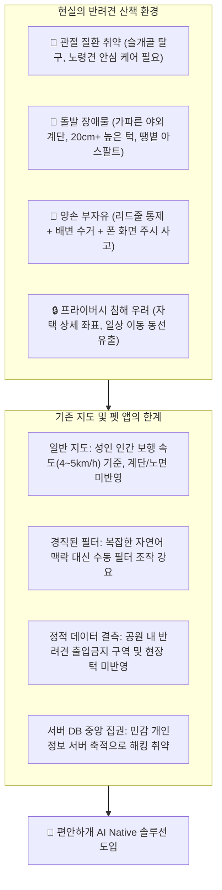
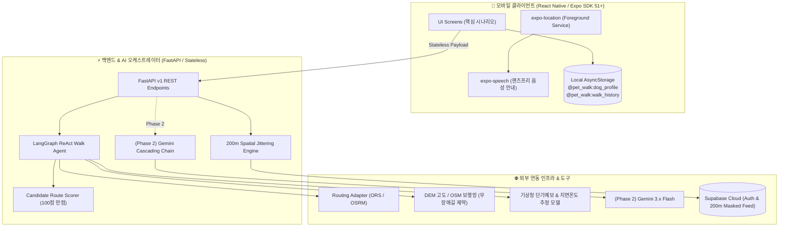
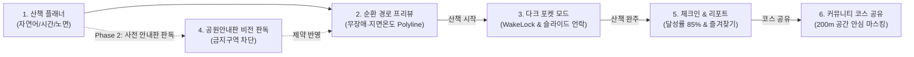

# 🐾 편안하개 (PetWalk)
> **AI Native 반려견 맞춤형 안심 노면 산책 에이전트 및 핸즈프리 모바일 플랫폼**  
> *"견주에게는 시선과 두 손의 자유를, 반려견에게는 관절 안심 발걸음을"*

[](https://www.python.org/)
[](https://fastapi.tiangolo.com/)
[](https://expo.dev/)
[](file:///d:/코디세이/pet_walk_t01/test_case/README.md)
[](https://opensource.org/licenses/MIT)

---

## ⚡ 빠른 데모 실행 가이드 (Quick Demo Guide)

웹 브라우저를 통해 **프론트엔드 인터랙티브 프로토타입**과 **6대 핵심 시나리오 목업 갤러리**를 바로 실행하여 체험할 수 있습니다.

### 1️⃣ 모바일 앱 실행 가이드 (React Native / Expo SDK)
편안하개는 스마트폰을 주머니에 넣은 채 산책할 수 있는 **모바일 네이티브 앱**입니다. Expo를 통해 실제 스마트폰(Expo Go 앱) 또는 에뮬레이터에서 즉시 구동할 수 있습니다.

```bash
# 1. 모바일 앱 폴더 이동 및 패키지 설치
cd frontend
npm install

# 2. Expo 개발 서버 시작 (QR코드를 스마트폰 카메라로 스캔)
npx expo start
```

---

### 2️⃣ 웹 브라우저 프로토타입 데모 (`web-demo`)
웹 브라우저에서 빠른 인터랙티브 동작을 확인하고 싶다면 분리된 웹 데모를 실행할 수 있습니다.

```bash
cd web-demo
npm install
npm run dev
# 접속 URL: http://localhost:5173
```

---

### 2️⃣ 6대 핵심 시나리오 인터랙티브 목업 갤러리 (HTML)
고대비 야외 시인성 및 한 손 조작 Thumb Zone이 적용된 6대 사용자 여정 화면(산책 플래너, 지도, 음성 내비, 피드백 등)을 한눈에 확인할 수 있습니다.

```bash
# Windows PowerShell에서 브라우저 열기
Start-Process mockup/index.html

# macOS
open mockup/index.html
```

---

### 3️⃣ TDD 핵심 엔진 전수 검증 (94개 테스트 100% Pass)
```bash
python -m pytest test_case/ -v
```

---

## 📖 목차 (Table of Contents)
0. [빠른 데모 실행 가이드 (Quick Demo Guide)](#-빠른-데모-실행-가이드-quick-demo-guide)
1. [프로젝트 개요 (Overview)](#-1-프로젝트-개요-overview)
2. [해결하고자 하는 핵심 문제 (Problem Statement)](#-2-해결하고자-하는-핵심-문제-problem-statement)
3. [4대 핵심 엔지니어링 전략 (Engineering Strategy)](#-3-4대-핵심-엔지니어링-전략-engineering-strategy)
4. [시스템 아키텍처 (System Architecture)](#-4-시스템-아키텍처-system-architecture)
5. [핵심 사용자 여정 및 화면 시나리오 (User Journey & Screens)](#-5-핵심-사용자-여정-및-화면-시나리오-user-journey--screens)
6. [5인 팀 R&R 및 애자일 스펙 (Team Roles & Agile Backlog)](#-6-5인-팀-rr-및-애자일-스펙-team-roles--agile-backlog)
7. [TDD 테스트 스위트 및 품질 가드레일 (Test-Driven Development)](#-7-tdd-테스트-스위트-및-품질-가드레일-test-driven-development)
8. [프로젝트 디렉터리 구조 (Directory Structure)](#-8-프로젝트-디렉터리-구조-directory-structure)
9. [시작하기 및 실행 방법 (Getting Started)](#-9-시작하기-및-실행-방법-getting-started)

---

## 🌟 1. 프로젝트 개요 (Overview)

**편안하개(PetWalk)**는 노령견이나 관절 보호가 필요한 반려견을 위해 **계단 회피, 완만 경사(DEM), 실시간 그늘길(SunCalc), 푹신한 노면(흙·잔디·탄성포장)**을 과학적으로 탐색하여 맞춤형 순환 산책 코스를 생성하는 **AI Native 모바일 산책 플랫폼**입니다.

기존 반려견 산책 앱이 단순 거리/배변 기록에 머무르거나 인간 보행 속도 기준의 상용 지도에 의존했던 한계를 극복하고, **LangGraph ReAct Agent**와 **Multimodal Vision AI(Gemini 3.x Cascading Chain)**를 통해 현장 맞춤형 산책 환경을 자율적으로 오케스트레이션합니다. 또한 스마트폰을 주머니에 넣은 채 산책할 수 있는 **초절전 다크 포켓 모드**와 **시선 해방(Eyes-Free) 핸즈프리 음성 내비게이션**을 지원합니다.

---

## 🚨 2. 해결하고자 하는 핵심 문제 (Problem Statement)



> [!IMPORTANT]
> **5대 핵심 해결 영역**
> 1. **자연어 산책 의도 정밀 구조화**: *"9살 노령 말티즈라 계단 피하고 완만한 길로 20분만"* ➔ LangGraph ReAct Agent가 Pydantic V2 Strict Schema로 변환 ([`US-A1`](file:///d:/코디세이/pet_walk_t01/docs/03_편안하개_Agile_User_Stories.md#L50-L64)).
> 2. **체급·연령별 적응형 시간-거리 환산**: 소형(2.8), 중형(3.6), 대형(4.2), 노령견(2.2 km/h) 보행 속도 모델 기반 목표 시간 $\pm 15\%$ 수렴 순환 루프 생성 ([`US-A3`](file:///d:/코디세이/pet_walk_t01/docs/03_편안하개_Agile_User_Stories.md#L80-L94)).
> 3. **다요소 과학 라우팅 & 종합 채점**: OSM 계단 완전 배제 + 15도 미만 무장애 완만경사 + 기상·노면 연동 지면온도 추정 및 고온 노면 회피 ➔ 100점 만점 최적 코스 도출 ([`US-B1~B3`](file:///d:/코디세이/pet_walk_t01/docs/03_편안하개_Agile_User_Stories.md#L96-L142)).
> 4. **현장 시각 위험 분석 & 동적 우회 (Phase 2 차기 고도화)**: Gemini Cascading Vision Pipeline으로 높은 턱 및 공원 종합안내판 판독, 위험 링크 10배 격리 후 3초 이내 대안 우회로 재탐색 ([`US-D1~D2`](file:///d:/코디세이/pet_walk_t01/docs/03_편안하개_Agile_User_Stories.md#L308-L343)).
> 5. **프라이버시 바이 디자인(Local-First)**: 자택 좌표 및 상세 GPS 트랙은 모바일 `AsyncStorage` 전용 보관, 커뮤니티 공유 시 출발/도착지 200m 공간 지터링 마스킹 ([`US-E1`](file:///d:/코디세이/pet_walk_t01/docs/03_편안하개_Agile_User_Stories.md#L209-L222), [`US-G2`](file:///d:/코디세이/pet_walk_t01/docs/03_편안하개_Agile_User_Stories.md#L267-L281)).

---

## 💡 3. 4대 핵심 엔지니어링 전략 (Engineering Strategy)

```
+--------------------------------------------------------------------------------------------------+
|                                 편안하개 4대 핵심 엔지니어링 전략                                  |
+--------------------------------------------------------------------------------------------------+
  [전략 1] C++ GIS 바닥 코딩 ❌  ➔  AI Agent 외부 도구 제어 & Routing API Adapter 연동 ⭕
  [전략 2] 화면 주시 보행 위험 ❌  ➔  React Native Expo 시선 해방(Eyes-Free) 음성 안내 & EAS OTA ⭕
  [전략 3] 소셜 로그인 & 서버 DB ❌ ➔  간편 이메일 가입 & 프라이버시 로컬 저장(Local-First) ⭕
  [전략 4] 과도한 스트리밍 인프라 ❌ ➔  예측 가능한 Stateless REST API & 5주 애자일 완결 ⭕
```

* **1. AI Agent 도구 오케스트레이션**: 무거운 지리 알고리즘을 직접 구현하지 않고, LangGraph ReAct Agent가 ORS/OSRM 라우팅 어댑터, DEM 고도 래스터, 지면온도 추정 모델을 표준 도구(`@tool`)로 유기적으로 지휘합니다. (Phase 2: Gemini Vision 체인 확장)
* **2. 시선 해방(Eyes-Free) & 두 손의 자유**: 한 손에 리드줄을 쥐고 화면을 보는 위험을 없애기 위해, Android Foreground Service 기반 백그라운드 GPS 추적과 `expo-speech` TTS 실시간 음성 브리핑(회전 30m 전 안내, 40m 이탈 경고)을 제공합니다.
* **3. 프라이버시 최우선 Local-First 아키텍처**: 반려견 프로필, 실보행 GPS 트랙, 자택 좌표는 기기 내부 `AsyncStorage`에만 보관하며, 클라우드(Supabase)는 200m 공간 마스킹된 공개 커뮤니티 코스와 현장 제보만 최소한으로 취합합니다.
* **4. 무중단 무선 배포 (EAS Build 1회 + EAS Update OTA)**: 번거로운 스토어 재심사나 APK 재설치 없이, `expo-updates` 무선 무점검 OTA를 통해 핫픽스와 UI 개선 사항을 실시간 반영합니다.

---

## 🏗️ 4. 시스템 아키텍처 (System Architecture)



---

## 📱 5. 핵심 사용자 여정 및 화면 시나리오 (User Journey & Screens)

편안하개는 사전 계획부터 보행, 완주, 커뮤니티 보강까지 끊김 없는 사용자 여정을 제공합니다. (인터랙티브 웹 갤러리: [`mockup/index.html`](file:///d:/코디세이/pet_walk_t01/mockup/index.html))



| 시나리오 화면 | 화면 명칭 | 연계 스토리 | 핵심 기능 및 UX 특징 |
|:---:|---|:---:|---|
| **01** | **맞춤형 산책 플래너**<br/>([`01_walk_planner.jpg`](file:///d:/코디세이/pet_walk_t01/mockup/01_walk_planner.jpg)) | `US-A1`<br>`US-A2`<br>`US-A3` | • 반려견 활성 프로필 카드 ('코코', 관절 안심 케어 집중)<br>• 자연어 질의 입력창 (*"관절 안심 케어가 필요한 코코 25분 폭신한 길"*)<br>• 10~90분 시간 슬라이더 및 선호 노면 선택 칩(흙길, 잔디길, 탄성포장) |
| **02** | **안심 순환 경로 프리뷰**<br/>([`02_route_preview.jpg`](file:///d:/코디세이/pet_walk_t01/mockup/02_route_preview.jpg)) | `US-B1~B3`<br>`US-C1` | • 노면/온도별 색상 분기 Polyline (🌿 안심/저온: `#10B981`, 🟤 흙길: `#92400E`, ⚠️ 고온주의: `#F97316`)<br>• 바텀시트: 총 1.4km, 예상 25분, 폭신한 길 비율 **82%** 표시<br>• 네이버/카카오 지도 원터치 외부 네비게이션 딥링크 제공 |
| **03** | **초절전 다크 포켓 모드**<br/>([`03_pocket_mode.jpg`](file:///d:/코디세이/pet_walk_t01/mockup/03_pocket_mode.jpg)) | `US-C2`<br>`US-E1` | • Screen Wake Lock & OLED True Black (`#000000`) 배터리 극소화<br>• 주머니 오터치 방지 '밀어서 잠금 해제(Slide to Unlock)' 엄지 조작<br>• 실시간 HUD(시간, 거리, 속도) 및 백그라운드 TTS 음성 브리핑 연동 |
| **04** | **공원안내판 비전 인스펙터 (Phase 2)**<br/>([`04_vision_inspection.jpg`](file:///d:/코디세이/pet_walk_t01/mockup/04_vision_inspection.jpg)) | `US-D1`<br>`US-D2`<br>*(Phase 2)* | • 공원 입구 오프라인 종합안내도 촬영 ➔ Gemini Flash 구조화 파싱<br>• 비포장 흙길 산책로 녹색 식별, 반려견 출입 금지 구역 붉은색 차단<br>• 금지구역 라우팅 격리 및 흙길 우선 경유 대안 순환로 즉시 수립 |
| **05** | **완주 체크인 & 안심 리포트**<br/>([`05_walk_report.jpg`](file:///d:/코디세이/pet_walk_t01/mockup/05_walk_report.jpg)) | `US-E2`<br>`US-E3` | • 선호 노면 달성률 게이지 (폭신한 길 85% 달성)<br>• 3초 원터치 체감 피드백(별점) 수집 ➔ 다음 산책 무상태 경사도 보정 반영<br>• 나만의 안심 코스 즐겨찾기(`@pet_walk:favorites`) 로컬 저장 |
| **06** | **커뮤니티 안심 공유 피드**<br/>([`06_community_enrichment.jpg`](file:///d:/코디세이/pet_walk_t01/mockup/06_community_enrichment.jpg)) | `US-G2` | • 출발지/도착지 **반경 200m 공간 지터링 및 절단**으로 자택 위치 완벽 은폐<br>• 검증된 동네 산책로 코스 공유 및 현장 위험 제보 등록 |

---

## 👥 6. 5인 팀 R&R 및 애자일 스펙 (Team Roles & Agile Backlog)

편안하개 프로젝트는 5인 전담 R&R과 **15개 핵심 애자일 사용자 스토리 (총 62 Story Points / 298 Hours, Phase 2 확장 별도)** 체계로 운영됩니다. (상세 명세: [`02_편안하개_Team_building.md`](file:///d:/코디세이/pet_walk_t01/docs/02_편안하개_Team_building.md), [`03_편안하개_Agile_User_Stories.md`](file:///d:/코디세이/pet_walk_t01/docs/03_편안하개_Agile_User_Stories.md))

| 번호 | 역할 명칭 (포지션) | 담당 팀원 | 핵심 R&R 및 주요 산출물 | 연계 사용자 스토리 |
|:---:|---|:---:|---|:---:|
| **1번** | **프로젝트 총괄·AI 기능 설계**<br/>(PM & AI Agent Lead) | **Member A** | • 전체 프로젝트 리딩, LangGraph ReAct 오케스트레이션<br>• 자연어 의도 파싱 스키마 설계 및 Candidate Route Scorer 튜닝 | `US-A1`, `US-A3`, `US-B3`, `US-E3`<br>*(Phase 2: US-D2)* |
| **2번** | **지도·공간데이터·AI 분석**<br/>(AI & Spatial Data Engineer) | **Member B** | • OSM 보행망·무장애길 데이터 정제, DEM 15도 미만 경사도 분석<br>• 기상청 지면온도 추정 모델 및 고온 노면 회피 파이프라인 | `US-B1`, `US-B2`, `US-F1`, `US-G1`, `US-G2`<br>*(Phase 2: US-D1, US-D2)* |
| **3번** | **서버·맞춤 경로 계산**<br/>(Backend & Spatial Routing Lead) | **Member C** | • FastAPI 무상태 REST API 개발, ORS/OSRM 라우팅 어댑터<br>• 무장애길 및 지면온도 비용 함수 구현, 200m 공간 지터링 알고리즘 | `US-B1~B3`, `US-F1`, `US-G1`, `US-G2`<br>*(Phase 2: US-D2)* |
| **4번** | **모바일 앱·GPS·음성 안내**<br/>(Frontend & Mobile App Lead) | **Member D** | • React Native Expo 모바일 앱 구축, Android Foreground Service GPS<br>• `expo-speech` 백그라운드 음성 브리핑, Local-First `AsyncStorage` | `US-A2`, `US-C1`, `US-C2`, `US-E1`, `US-E2`, `US-E3`, `US-H1`<br>*(Phase 2: US-D2)* |
| **5번** | **화면 구현·통합 테스트**<br/>(UI/UX Designer & Product Experience Lead) | **Member E** | • 핵심 시나리오 UI/UX 화면 개발, 고대비 시인성 토큰 적용<br>• 웰니스 카피라이팅 가드레일 준수, EAS Update 배포 및 5인 CBT 총괄 | `US-A2`, `US-A3`, `US-C1`, `US-E2`, `US-F1`, `US-G1`, `US-G2`, `US-H1` |

---

## 🧪 7. TDD 테스트 스위트 및 품질 가드레일 (Test-Driven Development)

본 프로젝트는 **TDD(Test-Driven Development) 및 ATDD(인수 테스트 주도 개발)**를 기반으로 구축되었으며, 18개 핵심 스토리 및 Phase 2 확장 백로그의 모든 인수 조건(Acceptance Criteria)과 완료 정의(DoD)를 테스트 코드로 100% 사전 검증합니다. (상세 가이드: [`test_case/README.md`](file:///d:/cody/pet_walk_t01/test_case/README.md))

### 7.1 테스트 스위트 구성 및 실행 결과
```bash
# 전체 TDD 테스트 스위트 실행 (88개 테스트 100% Pass)
python -m pytest test_case/ -v
```

```text
============================= test session starts =============================
platform win32 -- Python 3.11.x / pytest-9.x
rootdir: d:\cody\pet_walk_t01
collected 88 items

test_case/test_walk_plan_agent_schema.py ............                     [ 13%]
test_case/test_loop_target_duration.py ........                           [ 22%]
test_case/test_surface_cost_model.py .............                        [ 37%]
test_case/test_mobile_and_voice_navigation.py ......                      [ 44%]
test_case/test_vision_safety_inspector.py ...........                     [ 56%]
test_case/test_walk_tracking_and_feedback.py ...........                  [ 69%]
test_case/test_thermal_and_parking.py ......                              [ 76%]
test_case/test_api_contracts.py .........                                 [ 86%]
test_case/test_phase2_extended_features.py ............                   [100%]

============================= 88 passed in 0.48s ==============================
```

### 7.2 엄격한 품질 가드레일 (Enforced Guardrails)
1. **웰니스 카피라이팅 (Zero Medical Slang)**: 앱 UI, DTO, 테스트 코드 전역에서 '슬개골 탈구' 등 임상적 질병 공포 유발 단어를 배제하고, '관절 안심 케어', '폭신한 길' 등 순화된 웰니스 단어만을 사용하도록 자동 검사합니다.
2. **Gemini 3.x 순차 체인 (Cascading Chain)**: 구형 `gemini-1.5` 계열 사용을 전면 차단하고, `3.5-flash-lite` ➔ `3.1-flash-lite` ➔ `3.6-flash` 순으로 자동 폴백되도록 강제합니다.
3. **프라이버시 무결성**: 자택 좌표 서버 전송 0건 및 커뮤니티 공유 시 출발/도착지 200m 공간 지터링 마스킹을 테스트로 보증합니다.

---

## 📂 8. 프로젝트 디렉터리 구조 (Directory Structure)

```text
pet_walk_t01/
├── README.md                                  # [본 문서] 프로젝트 통합 개요 및 엔지니어링 표준
├── docs/                                      # 프로젝트 기획 및 엔지니어링 문서
│   ├── 02_편안하개_Team_building.md            # 5인 팀 R&R 및 4대 기술 엔지니어링 전략
│   ├── 03_편안하개_Agile_User_Stories.md       # 8대 에픽(A~H), 18개 사용자 스토리 및 DoD 명세서
│   └── 04_ai_problem_definition.md            # AI 문제 정의서 (아키텍처, 5대 문제, 성공 지표)
├── mockup/                                    # 예상 사용 시나리오 스크린 갤러리 및 UI 목업
│   ├── index.html                             # 인터랙티브 스크린 뷰어 웹 애플리케이션
│   ├── README.md                              # 6대 화면 상세 기능 및 UX 명세서
│   └── 01_walk_planner.jpg ~ 06_...jpg        # 핵심 사용자 여정 화면 고화질 목업
├── UI_design/                                 # 앱 디자인 무드보드 및 에셋
├── test_case/                                 # TDD 종합 테스트 스위트 (88개 테스트 전수 Pass)
│   ├── README.md                              # TDD 스위트 구조 및 실행 가이드
│   ├── conftest.py                            # 5인 CBT 프로필, OSM 네트워크, GeoJSON Fixture
│   ├── test_walk_plan_agent_schema.py         # [US-A1, A2, E3] 자연어 파싱, 프로필, 피드백 보정
│   ├── test_loop_target_duration.py          # [US-A3] 보행 속도 모델 및 순환 루프 수렴 검증
│   ├── test_surface_cost_model.py             # [US-B1~B4] 계단 회피, DEM 경사, 그늘, 스코어러
│   ├── test_mobile_and_voice_navigation.py    # [US-C1, C2] Polyline 색상 분기, TTS 음성 안내
│   ├── test_vision_safety_inspector.py        # [US-D1, D2] Gemini 체인, 턱/장애물/안내판 판독
│   ├── test_walk_tracking_and_feedback.py     # [US-E1, E2, H1] 로컬 GPS 저장, EAS OTA, CBT 튜닝
│   ├── test_thermal_and_parking.py            # [US-F1, G1] 기상청 지면열 추정, P&R 주차장 필터
│   ├── test_api_contracts.py                  # [US-G2] 200m 공간 마스킹 및 REST API Contract
│   └── test_phase2_extended_features.py       # [Phase 2] 긴급 귀환, 다견, 헥사곤 점령, 즐겨찾기
├── backend/                                   # FastAPI 백엔드 애플리케이션 (구현 대상)
├── frontend/                                  # React Native Expo 모바일 앱 (구현 대상)
├── .gemini/                                   # Gemini Code Assist 전역 지침 및 코딩 룰
│   ├── GEMINI.md                              # 코딩 어시스턴트 핵심 준수 지침
│   ├── coding_rule.md                         # SonarLint 및 정적 분석 통합 코딩 컨벤션
│   └── UX_COMPACT_RULES.md                    # 야외 모바일 고대비 및 Thumb Zone UX 규칙
└── .agents/rules/                             # AI Pair Programming 자동 점검 규칙
```

---

## 🚀 9. 시작하기 및 실행 방법 (Getting Started)

### 9.1 환경 요구사항
* **Python**: 3.11 이상
* **Node.js**: 20.x 이상 (Frontend 구현 시)
* **pytest**: 8.x 이상

### 9.2 의존성 설치 및 TDD 테스트 실행
```bash
# 1. 저장소 클론
git clone https://github.com/haru2014/pet_walk_t01.git
cd pet_walk_t01

# 2. 파이썬 가상환경 생성 및 활성화
python -m venv .venv
# Windows
.venv\Scripts\activate
# macOS / Linux
source .venv/bin/activate

# 3. 필수 패키지 설치
pip install pytest pydantic

# 4. 전체 TDD 테스트 스위트 실행
python -m pytest test_case/ -v
```

### 9.3 인터랙티브 목업 갤러리 확인
프로젝트의 6대 핵심 시나리오 화면을 브라우저에서 바로 확인할 수 있습니다:
```bash
# 기본 브라우저로 목업 갤러리 열기 (Windows PowerShell)
Start-Process mockup/index.html
```

---

## 📜 라이선스 및 저작권 (License)
본 프로젝트는 **MIT License**에 따라 자유롭게 사용 및 수정할 수 있습니다. 자세한 내용은 라이선스 문서를 참조하십시오.
