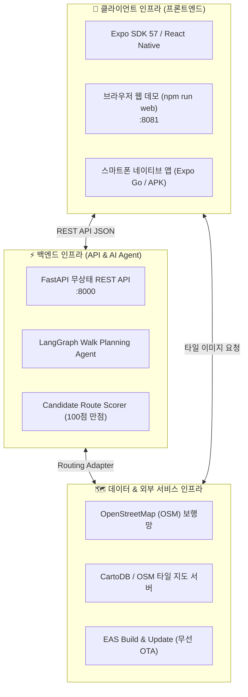

# 🛠️ [01] 편안하개 프로젝트 인프라 구축 및 환경 설정 가이드 (초보자용)

> **문서 대상**: 편안하개 프로젝트를 처음 클론받아 로컬 환경에서 서버, 앱, 웹 데모를 직접 구동하고 빌드하려는 개발자 및 테스터  
> **최종 수정일**: 2026년 10월 10일  
> **연계 문서**:  
> - [`docs/02_편안하개_Team_building.md`](/docs/02_편안하개_Team_building.md)  
> - [`docs/05_편안하개_프로젝트_수행계획서_일정.md`](/docs/05_편안하개_프로젝트_수행계획서_일정.md)  
> - [`docs/99.member4_implementation_status_report.md`](/docs/99.member4_implementation_status_report.md)  

---

## 📌 1. 편안하개 전체 인프라 구조 한눈에 보기

편안하개는 **"견주에게는 시선과 두 손의 자유를, 반려견에게는 관절 안심 발걸음을"** 제공하기 위해, 크게 **3대 인프라 레이어**로 구성되어 있습니다.



1. **클라이언트 (Frontend)**: React Native (Expo SDK 57) 기반 단일 코드베이스로, 스마트폰 앱과 PC 웹 브라우저 데모를 동시에 구동합니다.
2. **백엔드 (Backend)**: Python FastAPI 기반 무상태(Stateless) 서버로, LangGraph AI 에이전트와 맞춤 보행로 알고리즘을 수행합니다.
3. **배포 인프라 (EAS & OTA)**: Expo Application Services(EAS)를 통해 APK를 1회 배포하고, 무선 OTA(`eas update`)로 실시간 업데이트를 배포합니다.

---

## 💻 2. 사전 필수 도구 설치 (Prerequisites)

내 컴퓨터에 아래의 프로그램들이 설치되어 있어야 합니다. 터미널(PowerShell 또는 Terminal)을 열고 버전을 확인해 보세요.

| 도구 명칭 | 권장 버전 | 확인 명령어 | 다운로드 링크 |
|---|---|---|---|
| **Git** | 최신 버전 | `git --version` | [git-scm.com](https://git-scm.com/) |
| **Node.js** | **v20.x LTS** 이상 | `node -v` | [nodejs.org](https://nodejs.org/) |
| **Python** | **3.11.x** 이상 | `python --version` | [python.org](https://www.python.org/) |
| **VS Code** | 최신 버전 | `code -v` | [code.visualstudio.com](https://code.visualstudio.com/) |

---

## ⚡ 3. 백엔드 AI/라우팅 서버 인프라 구축 (Step-by-Step)

백엔드는 반려견의 체급, 경사도 제한, 계단 회피 조건을 받아 최적의 산책 경로(GeoJSON)를 계산하는 코어 서버입니다.

### Step 3.1. 파이썬 가상환경(venv) 생성 및 활성화
독립된 파이썬 라이브러리 환경을 구축하기 위해 가상환경을 만듭니다.

```bash
# 1. 프로젝트 최상위 루트 폴더로 이동
cd d:/코디세이/pet_walk_t01

# 2. venv 가상환경 생성 (.venv 폴더 생성)
python -m venv .venv

# 3. 가상환경 활성화
# Windows PowerShell
.\.venv\Scripts\Activate.ps1

# macOS / Linux
source .venv/bin/activate
```
> 💡 **참고**: 터미널 프롬프트 앞에 `(.venv)`가 붙으면 성공적으로 활성화된 것입니다.

### Step 3.2. 백엔드 필수 패키지 설치
AI 에이전트(LangGraph, Pydantic) 및 테스트(Pytest) 라이브러리를 설치합니다.

```bash
# pip 최신화 및 의존성 설치
python -m pip install --upgrade pip
pip install fastapi uvicorn pydantic pytest
```

### Step 3.3. 백엔드 핵심 알고리즘 100% 무결성 검증 (TDD)
서버를 띄우기 전, 프로젝트에 내장된 100개 테스트가 정상 통과하는지 확인합니다.

```bash
python -m pytest test_case/ -v
# 출력: 100 passed in ...s (초록색 100% 통과 확인)
```

### Step 3.4. 백엔드 로컬 서버 실행
```bash
# 백엔드 서버 가동 (기본 포트: 8000)
uvicorn agent.walk_planning_agent:app --host 0.0.0.0 --port 8000 --reload
```
* **서버 주소**: `http://localhost:8000`
* **대화형 API 문서 (Swagger UI)**: `http://localhost:8000/docs` (브라우저에서 접속하여 API 테스트 가능)

---

## 📱 4. 프론트엔드 모바일 앱 & 웹 데모 인프라 구축

React Native 소스코드 단 1벌로 **스마트폰(Expo Go)**과 **웹 브라우저(Expo Web)**를 즉시 실행할 수 있습니다.

### Step 4.1. 프론트엔드 폴더 이동 및 패키지 설치
새 터미널 창을 열고 아래 명령어를 입력합니다.

```bash
# 1. frontend 디렉터리로 이동
cd frontend

# 2. Node.js 의존성 패키지 설치
npm install
```

### Step 4.2. 웹 브라우저 프로토타입 데모 실행 (가장 추천 ⭐)
별도의 스마트폰 에뮬레이터 없이 웹 브라우저에서 즉시 체험할 수 있습니다.

```bash
npm run web
```
* **접속 주소**: **`http://localhost:8081`**
* **특징**:
  - 스마트폰 규격(Phone Mockup) 쉘 뷰로 자동 렌더링.
  - 실제 OpenStreetMap 도로/공원 지도 타일 위에 3색 안심 Polyline과 스텝 핀 표시.
  - 코드를 수정하면 브라우저 새로고침 없이 즉시 반영되는 Fast Refresh(HMR) 지원.

### Step 4.3. 실제 스마트폰에서 실행 (Expo Go 모바일 앱)
스마트폰을 직접 들고 산책하며 핸즈프리 음성 안내를 체감하고 싶을 때 사용합니다.

1. **스마트폰 준비**: Google Play Store 또는 Apple App Store에서 **"Expo Go"** 앱 설치.
2. **개발 서버 실행**:
   ```bash
   npx expo start
   ```
3. **연결**: 터미널에 나타난 대형 **QR 코드**를 스마트폰 기본 카메라(iOS) 또는 Expo Go 앱(Android)으로 스캔하면 앱이 즉시 실행됩니다.

---

## ☁️ 5. EAS Build (APK 패키징) & 무선 OTA 배포 인프라

팀 프로젝트 마일스톤에 따라 테스터들에게 APK를 설치하고 무선으로 실시간 코드를 업데이트하는 클라우드 인프라입니다.

### Step 5.1. Expo CLI 및 EAS CLI 로그인
```bash
# EAS 글로벌 CLI 설치
npm install -g eas-cli

# Expo 계정 로그인 (계정이 없다면 expo.dev에서 무료 가입)
eas login
```

### Step 5.2. Android 테스터용 APK 1회 패키징 (`eas.json`)
```bash
# Android 설치용 독립 APK 빌드 (10월 30일 마일스톤 진행 시)
eas build -p android --profile preview
```
빌드가 완료되면 다운로드 링크가 터미널에 생성되며, 테스터들은 이 APK를 다운받아 스마트폰에 1회 설치합니다.

### Step 5.3. 무선 실시간 핫픽스 배포 (`eas update` 무선 OTA)
앱을 다시 빌드하거나 테스터가 재설치할 필요 없이, 코드 수정 사항을 무선으로 즉시 배포합니다.

```bash
eas update --branch preview --message "fix: 실제 도로 배경 타일 연동 및 음성 안내 타이밍 개선"
```
테스터가 앱을 껐다 켜면 최신 수정 사항이 자동으로 다운로드되어 무점검 반영됩니다.

---

## 🗺️ 6. 지도 및 공간 데이터(OSM / DEM) 인프라 이해

편안하개는 비싼 상용 지도 라이선스 비용 없이 오픈소스를 결합하여 운영할 수 있도록 설계되었습니다.

1. **OpenStreetMap (OSM) 보행망**: 전 세계 자원봉사자들이 구축한 무료 지리 데이터로, 계단(`highway=steps`), 보도, 횡단보도 속성을 무료로 필터링합니다.
2. **CartoDB / OSM 타일 서버**: `https://a.basemaps.cartocdn.com/rastertiles/voyager/{z}/{x}/{y}.png`를 활용해 API 키 없이 고해상도 도로 배경 타일을 지도 뒤에 깔아줍니다.
3. **수치표고모델 (DEM)**: 국토지리정보원 및 공공데이터의 고도 래스터를 통해 15도 미만 완만길을 과학적으로 판별합니다.

---

## ❓ 7. 초보자 트러블슈팅 FAQ (자주 묻는 질문)

### Q1. `npm run web`을 쳤는데 `num run web` 에러가 떠요!
* **원인**: 키보드 오타(`p` 대신 `u`)로 발생한 문제입니다.
* **해결**: 올바른 명령어인 **`npm run web`**을 다시 입력하시면 정상 실행됩니다.

### Q2. 포트 8081 또는 8000이 이미 사용 중이라는 오류가 발생해요!
* **원인**: 이전 프로세스가 백그라운드에 남아있을 때 발생합니다.
* **해결**:
  ```powershell
  # Windows에서 포트 점유 프로세스 확인 및 종료
  Get-Process node, python -ErrorAction SilentlyContinue | Stop-Process -Force
  ```

### Q3. 백엔드 서버를 켜지 않아도 프론트엔드 웹 데모가 작동하나요?
* **답변**: **네, 100% 정상 작동합니다.**
* 프론트엔드에 **오프라인 Mock 자동 폴백([`src/services/api.ts`](/frontend/src/services/api.ts))**이 탑재되어 있어, 백엔드 서버가 꺼져 있어도 0.1초 만에 안전한 로컬 코스로 자동 전환되어 지도가 정상 표시됩니다.

### Q4. 지도에 도로 배경이 안 보이고 격자만 떠요!
* 최신 업데이트가 적용되어 이제 하단 탭의 **`산책`** 탭을 누르면 **실제 서울숲 인근 OpenStreetMap 도로 타일**이 배경에 선명하게 표시됩니다.
