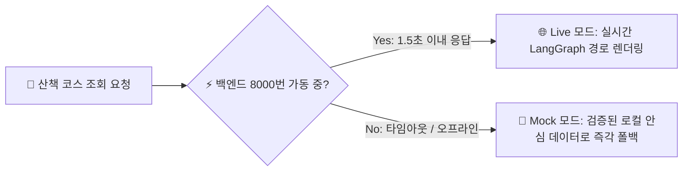

# 🛠️ [01] 편안하개 프로젝트 인프라 구축 및 환경 설정 가이드 (초보자용)

> **문서 대상**: 편안하개 프로젝트를 처음 클론받아 로컬 환경에서 서버, 앱, 웹 데모를 직접 구동하고 빌드하려는 개발자 및 테스터  
> **최종 수정일**: 2026년 10월 10일  
> **연계 문서**:  
> - [`docs/02_편안하개_Team_building.md`](/docs/02_편안하개_Team_building.md)  
> - [`docs/05_편안하개_프로젝트_수행계획서_일정.md`](/docs/05_편안하개_프로젝트_수행계획서_일정.md)  
> - [`docs/99.member4_implementation_status_report.md`](/docs/99.member4_implementation_status_report.md)  

---

## 📌 1. 편안하개 전체 인프라 구조 한눈에 보기

편안하개는 **"견주에게는 시선과 두 손의 자유를, 반려견에게는 관절 안심 발걸음을"** 제공하기 위해, 크게 **4대 인프라 레이어**로 구성되어 있습니다.

```mermaid
flowchart TD
    subgraph Client["📱 클라이언트 인프라 (프론트엔드)"]
        A1["Expo SDK 57 / React Native"]
        A2["브라우저 웹 데모 (npm run web)<br/>:8081"]
        A3["스마트폰 네이티브 앱 (Expo Go / APK)"]
    end

    subgraph Server["⚡ 백엔드 인프라 (API & AI Agent)"]
        B1["FastAPI 무상태 REST API<br/>:8000"]
        B2["LangGraph Walk Planning Agent"]
        B3["Candidate Route Scorer (100점 만점)"]
    end

    subgraph CloudBaaS["☁️ 인증 & 커뮤니티 클라우드 (Supabase)"]
        D1["Supabase Auth (간편 이메일 가입)"]
        D2["PostgreSQL DB (200m 마스킹 공개 코스)"]
    end

    subgraph DataGIS["🗺️ 데이터 & 배포 인프라"]
        C1["OpenStreetMap (OSM) 보행망 & DEM"]
        C2["CartoDB / OSM 타일 지도 서버"]
        C3["EAS Build & Update (무선 OTA)"]
    end

    Client <-->|REST API JSON (듀얼 모드)| Server
    Client <-->|인증 & 커뮤니티 피드| CloudBaaS
    Server <-->|Routing Adapter| DataGIS
    Client <-->|타일 이미지 요청| DataGIS
```

1. **클라이언트 (Frontend)**: React Native (Expo SDK 57) 기반 단일 코드베이스로, 스마트폰 앱과 PC 웹 브라우저 데모를 동시에 구동합니다.
2. **백엔드 (Backend)**: Python FastAPI 기반 무상태(Stateless) 서버로, LangGraph AI 에이전트와 맞춤 보행로 알고리즘을 수행합니다.
3. **클라우드 BaaS (Supabase)**: 카카오/구글 등 복잡한 소셜 로그인 대신, 간편한 이메일 가입(Supabase Auth)과 커뮤니티 공개 코스(200m 마스킹) DB를 관리합니다.
4. **배포 인프라 (EAS & OTA)**: Expo Application Services(EAS)를 통해 APK를 1회 배포하고, 무선 OTA(`eas update`)로 실시간 업데이트를 배포합니다.

---

## 💻 2. 사전 필수 도구 설치 (Prerequisites)

내 컴퓨터에 아래의 프로그램들이 설치되어 있어야 합니다. 터미널(PowerShell 또는 Terminal)을 열고 버전을 확인해 보세요.

| 도구 명칭 | 권장 버전 | 확인 명령어 | 다운로드 링크 |
|---|---|---|---|
| **Git** | 최신 버전 | `git --version` | [git-scm.com](https://git-scm.com/) |
| **Node.js** | **v20.x LTS** 이상 | `node -v` | [nodejs.org](https://nodejs.org/) |
| **Python** | **3.11.x** 이상 | `python --version` | [python.org](https://www.python.org/) |
| **VS Code** | 최신 버전 | `code -v` | [code.visualstudio.com](https://code.visualstudio.com/) |

---

## ⚡ 3. 백엔드 AI/라우팅 서버 인프라 구축 (Step-by-Step)

백엔드는 반려견의 체급, 경사도 제한, 계단 회피 조건을 받아 최적의 산책 경로(GeoJSON)를 계산하는 코어 서버입니다.

### Step 3.1. 파이썬 가상환경(venv) 생성 및 활성화
독립된 파이썬 라이브러리 환경을 구축하기 위해 가상환경을 만듭니다.

```bash
# 1. 프로젝트 최상위 루트 폴더로 이동
cd d:/코디세이/pet_walk_t01

# 2. venv 가상환경 생성 (.venv 폴더 생성)
python -m venv .venv

# 3. 가상환경 활성화
# Windows PowerShell
.\.venv\Scripts\Activate.ps1

# macOS / Linux
source .venv/bin/activate
```
> 💡 **참고**: 터미널 프롬프트 앞에 `(.venv)`가 붙으면 성공적으로 활성화된 것입니다.

### Step 3.2. 백엔드 필수 패키지 설치
AI 에이전트(LangGraph, Pydantic) 및 테스트(Pytest) 라이브러리를 설치합니다.

```bash
# pip 최신화 및 의존성 설치
python -m pip install --upgrade pip
pip install fastapi uvicorn pydantic pytest
```

### Step 3.3. 백엔드 핵심 알고리즘 100% 무결성 검증 (TDD)
서버를 띄우기 전, 프로젝트에 내장된 100개 테스트가 정상 통과하는지 확인합니다.

```bash
python -m pytest test_case/ -q
# 출력: 100 passed in 0.52s (초록색 100% 통과 확인)
```

### Step 3.4. 백엔드 로컬 서버 실행
```bash
# 백엔드 서버 가동 (기본 포트: 8000)
uvicorn main:app --host 0.0.0.0 --port 8000 --reload
```
* **서버 주소**: `http://localhost:8000`
* **헬스 체크**: `http://localhost:8000/health` (`{"status": "ok", "mode": "live"}`)
* **대화형 API 문서 (Swagger UI)**: `http://localhost:8000/docs` (브라우저에서 접속하여 API 실시간 테스트 가능)

---

## 📱 4. 프론트엔드 모바일 앱 & 웹 데모 인프라 구축

React Native 소스코드 단 1벌로 **스마트폰(Expo Go)**과 **웹 브라우저(Expo Web)**를 즉시 실행할 수 있습니다.

### Step 4.1. 프론트엔드 폴더 이동 및 패키지 설치
새 터미널 창을 열고 아래 명령어를 입력합니다.

```bash
# 1. frontend 디렉터리로 이동
cd frontend

# 2. Node.js 의존성 패키지 설치
npm install
```

### Step 4.2. 웹 브라우저 프로토타입 데모 실행 (가장 추천 ⭐)
별도의 스마트폰 에뮬레이터 없이 웹 브라우저에서 즉시 체험할 수 있습니다.

```bash
npm run web
```
* **접속 주소**: **`http://localhost:8081`**
* **특징**:
  - 스마트폰 규격(Phone Mockup) 쉘 뷰로 자동 렌더링.
  - 실제 OpenStreetMap 도로/공원 지도 타일 위에 3색 안심 Polyline과 스텝 핀 표시.
  - 코드를 수정하면 브라우저 새로고침 없이 즉시 반영되는 Fast Refresh(HMR) 지원.

### Step 4.3. 실제 스마트폰에서 실행 (Expo Go 모바일 앱)
스마트폰을 직접 들고 산책하며 핸즈프리 음성 안내를 체감하고 싶을 때 사용합니다.

1. **스마트폰 준비**: Google Play Store 또는 Apple App Store에서 **"Expo Go"** 앱 설치.
2. **개발 서버 실행**:
   ```bash
   npx expo start
   ```
3. **연결**: 터미널에 나타난 대형 **QR 코드**를 스마트폰 기본 카메라(iOS) 또는 Expo Go 앱(Android)으로 스캔하면 앱이 즉시 실행됩니다.

---

## 🔄 5. Step 2 듀얼 모드 (Live API vs 오프라인 Mock) 동작 및 검증

프론트엔드에는 **"Smart Client 듀얼 모드"**가 탑재되어 있어, 백엔드 서버 상태에 관계없이 무중단 데모가 가능합니다.



### 1️⃣ 동작 원리
1. **Live 모드 (`isLiveServer: true`)**:
   - `uvicorn main:app --port 8000`이 실행 중일 때, 프론트엔드가 실제 백엔드(`POST /api/v1/walk/plan`)를 호출하여 AI 추천 코스를 수신합니다.
   - 화면 상단에 **`[🌐 실시간 AI 서버 연결됨]`** 녹색 뱃지가 표시됩니다.
2. **오프라인 안전 Mock 모드 (`isLiveServer: false`)**:
   - 백엔드 서버가 꺼져 있거나 와이파이가 끊겨도, 프론트엔드가 멈추지 않고 0.1초 만에 내장된 안심 데이터([`sampleRoute.ts`](/frontend/src/services/sampleRoute.ts))로 안전하게 폴백합니다.
   - 화면 상단에 **`[🌿 로컬 안심 모드 (오프라인)]`** 회색 뱃지가 표시됩니다.

### 2️⃣ 듀얼 모드 직접 테스트해보기
1. **오프라인 모드 확인**: 백엔드 터미널을 끈 상태에서 브라우저(`http://localhost:8081`) 하단 **`산책`** 탭 접속 ➔ `[🌿 로컬 안심 모드 (오프라인)]` 표시 확인.
2. **Live 모드 전환 확인**: 백엔드 터미널에서 `uvicorn main:app --port 8000 --reload` 실행 ➔ 브라우저 새로고침 시 `[🌐 실시간 AI 서버 연결됨]`으로 자동 전환 확인!

---

## ☁️ 6. Expo 및 EAS 배포 인프라 설정 가이드 (회원가입 ~ OTA)

팀원들과 테스터들에게 스토어 심사 없이 실제 Android 스마트폰에 APK를 배포하고, 무선으로 실시간 업데이트(OTA)를 적용하기 위한 클라우드 인프라 설정입니다.

### Step 6.1. Expo 회원가입
1. 브라우저에서 **[expo.dev](https://expo.dev/)** 접속 후 **[Sign Up]** 클릭.
2. 이메일, 사용자명(Username), 비밀번호를 입력하여 무료 계정 생성.
3. 가입 후 이메일 인증 완료.

### Step 6.2. EAS CLI 설치 및 로그인
터미널을 열고 다음 명령어를 실행합니다.

```bash
# 1. EAS Command Line Interface 전역 설치
npm install -g eas-cli

# 2. 터미널에서 Expo 계정으로 로그인
eas login
# (아이디와 비밀번호를 입력하여 "Logged in as <username>" 확인)
```

### Step 6.3. 프로젝트 EAS 등록 및 프로젝트 ID 발급
```bash
cd frontend

# 프로젝트 등록 및 projectId 자동 발급
eas project:init
```
> 실행 후 터미널 안내에 따라 진행하면 `frontend/app.json`에 `extra.eas.projectId`가 자동으로 등록됩니다.

### Step 6.4. EAS 빌드 프로필 파일 (`eas.json`) 구성
`frontend/eas.json` 파일이 프로젝트 루트에 생성되어 있는지 확인합니다 (없다면 아래 내용으로 생성).

```json
{
  "cli": {
    "version": ">= 12.0.0"
  },
  "build": {
    "development": {
      "developmentClient": true,
      "distribution": "internal"
    },
    "preview": {
      "distribution": "internal",
      "android": {
        "buildType": "apk"
      }
    },
    "production": {}
  },
  "submit": {
    "production": {}
  }
}
```

### Step 6.5. Android 테스터용 APK 1회 패키징 빌드
```bash
# Android 설치용 독립 APK 빌드 (10월 30일 마일스톤)
eas build -p android --profile preview
```
빌드가 완료되면 터미널에 생성된 다운로드 링크(`https://expo.dev/artifacts/...`)를 통해 테스터의 스마트폰에 APK를 1회 설치합니다.

### Step 6.6. 무선 실시간 핫픽스 배포 (`eas update` 무선 OTA)
테스터가 APK를 다시 설치할 필요 없이, 소스코드 수정 사항을 무선으로 즉시 배포합니다.

```bash
# preview 채널로 무선 핫픽스 발행
eas update --branch preview --message "fix: 실제 도로 배경 타일 연동 및 음성 브리핑 타이밍 개선"
```
스마트폰에서 앱을 재기동하면 새로운 코드가 무선으로 자동 다운로드되어 실행됩니다!

---

## 🗄️ 7. Supabase 클라우드 BaaS 인프라 설정 가이드 (회원가입 ~ DB 스키마)

개인정보 침해 없는 Local-First 정책을 준수하면서도, 커뮤니티 공개 코스(200m 마스킹) 공유와 간편 이메일 로그인을 지원하기 위한 Supabase 설정법입니다.

### Step 7.1. Supabase 회원가입 및 무료 프로젝트 생성
1. 브라우저에서 **[supabase.com](https://supabase.com/)** 접속 후 **[Start your project]** 클릭.
2. GitHub 계정으로 간편 가입(Sign in with GitHub) 후 로그인.
3. 대시보드에서 **[New Project]** 클릭:
   - **Name**: `petwalk-backend`
   - **Database Password**: 안전한 비밀번호 입력 (메모 필수)
   - **Region**: `Northeast (Seoul)` 선택 (한국 지역 선택 시 지연 시간 최소화)
   - **Pricing Plan**: `Free Plan ($0)` 선택 후 **[Create new project]** 클릭.
4. 약 1~2분 후 프로젝트 생성이 완료됩니다.

### Step 7.2. API 키 및 연결 URL 확인
1. 좌측 메뉴 하단의 **⚙️ Project Settings** > **API** 클릭.
2. 아래 2가지 값을 복사하여 보관합니다:
   - **Project URL**: `https://xxxxxxxxxxxx.supabase.co`
   - **anon public key**: `eyJhbGciOi...` (클라이언트용 공개 키)

### Step 7.3. Supabase Auth 간편 이메일 가입 설정
테스터들의 빠른 가입을 위해 복잡한 이메일 인증 절차를 자동 완료 처리하도록 설정합니다.

1. 좌측 메뉴의 **Authentication** > **Providers** 클릭.
2. **Email** 제공자를 클릭하여:
   - **Enable Email provider**: `ON` (활성화)
   - **Confirm email**: `OFF` (체크 해제 ➔ CBT 기간 동안 이메일 인증 링크 클릭 없이 즉시 가입 완료)
3. **[Save]** 클릭.

### Step 7.4. 커뮤니티 데이터베이스 테이블 생성 (SQL Editor)
좌측 메뉴의 **SQL Editor**를 누르고 **[New query]**를 클릭한 후, 아래 SQL을 붙여넣고 **[Run]**을 실행합니다.

```sql
-- 1. 커뮤니티 공개 코스 테이블 (출발/도착 200m 마스킹된 코스)
CREATE TABLE IF NOT EXISTS public.community_courses (
    id UUID PRIMARY KEY DEFAULT gen_random_uuid(),
    user_id UUID REFERENCES auth.users(id) ON DELETE CASCADE,
    title VARCHAR(100) NOT NULL,
    masked_polyline JSONB NOT NULL, -- 200m 공간 절단된 위경도 배열
    distance_meters FLOAT NOT NULL,
    duration_minutes INT NOT NULL,
    rating FLOAT DEFAULT 5.0,
    comment TEXT,
    created_at TIMESTAMP WITH TIME ZONE DEFAULT timezone('utc'::text, now()) NOT NULL
);

-- 2. 현장 돌발 위험 제보 테이블 (공사구간, 턱, 빙판 등)
CREATE TABLE IF NOT EXISTS public.hazard_reports (
    id UUID PRIMARY KEY DEFAULT gen_random_uuid(),
    reporter_id UUID REFERENCES auth.users(id) ON DELETE SET NULL,
    hazard_type VARCHAR(50) NOT NULL, -- 'steep_stairs', 'obstacle', 'heat_surface'
    latitude FLOAT NOT NULL,
    longitude FLOAT NOT NULL,
    description TEXT,
    photo_url TEXT,
    created_at TIMESTAMP WITH TIME ZONE DEFAULT timezone('utc'::text, now()) NOT NULL
);

-- 3. 누구나 공개 코스를 조회할 수 있도록 RLS(Row Level Security) 설정
ALTER TABLE public.community_courses ENABLE ROW LEVEL SECURITY;
CREATE POLICY "Public Read Community Courses" ON public.community_courses FOR SELECT USING (true);
CREATE POLICY "Users can insert courses" ON public.community_courses FOR INSERT WITH CHECK (auth.uid() = user_id);
```

### Step 7.5. 환경 변수 파일(`.env`) 구성
프로젝트 최상위 디렉터리에 `.env` 파일을 생성하고 발급받은 값을 입력합니다:

```env
# 백엔드 API 서버 URL
EXPO_PUBLIC_API_URL=http://localhost:8000

# Supabase 클라우드 설정
SUPABASE_URL=https://xxxxxxxxxxxx.supabase.co
SUPABASE_ANON_KEY=eyJhbGciOi...
```

---

## 🗺️ 8. OpenRouteService(ORS) 외부 라우팅 인프라 설정

백엔드가 실제 보행망 순환 루프 경로를 연산할 때 사용하는 표준 라우팅 엔진입니다.

1. **[openrouteservice.org](https://openrouteservice.org/)** 회원가입 후 로그인.
2. **Dashboard** > **Tokens**에서 **[Create Token]** 클릭 (Token type: `Standard / Free`).
3. 발급받은 API 키를 `.env` 파일에 추가:
   ```env
   ORS_API_KEY=58d34xxxxxxxxxxxxxxxxxxxxxx
   ```
> 💡 **참고**: 개발 초기나 오프라인 환경에서는 내장된 OSRM 로컬 모듈 및 Mock 어댑터가 작동하므로, ORS 키 없이도 모든 기능이 정상 구동됩니다.

---

## ❓ 9. 초보자 트러블슈팅 FAQ (자주 묻는 질문)

### Q1. `npm run web`을 쳤는데 `num run web` 에러가 떠요!
* **원인**: 키보드 오타(`p` 대신 `u`)로 발생한 문제입니다.
* **해결**: 올바른 명령어인 **`npm run web`**을 다시 입력하시면 정상 실행됩니다.

### Q2. 포트 8081 또는 8000이 이미 사용 중이라는 오류가 발생해요!
* **원인**: 이전 프로세스가 백그라운드에 남아있을 때 발생합니다.
* **해결**:
  ```powershell
  # Windows에서 포트 점유 프로세스 확인 및 종료
  Get-Process node, python -ErrorAction SilentlyContinue | Stop-Process -Force
  ```

### Q3. 백엔드 서버를 켜지 않아도 프론트엔드 웹 데모가 작동하나요?
* **답변**: **네, 100% 정상 작동합니다.**
* 프론트엔드에 **오프라인 Mock 자동 폴백([`src/services/api.ts`](/frontend/src/services/api.ts))**이 탑재되어 있어, 백엔드 서버가 꺼져 있어도 0.1초 만에 안전한 로컬 코스로 자동 전환되어 지도가 정상 표시됩니다.

### Q4. 지도에 도로 배경이 안 보이고 격자만 떠요!
* 최신 업데이트가 적용되어 이제 하단 탭의 **`산책`** 탭을 누르면 **실제 서울숲 인근 OpenStreetMap 도로 타일**이 배경에 선명하게 표시됩니다.
