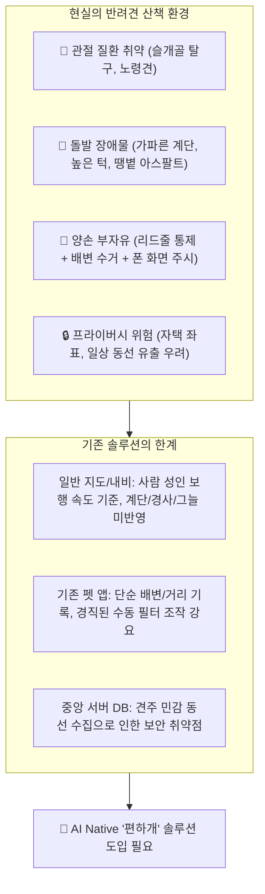
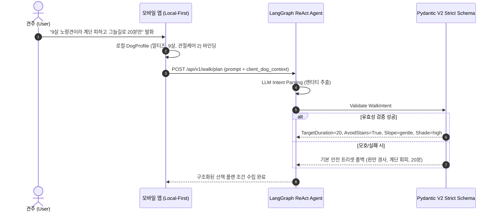
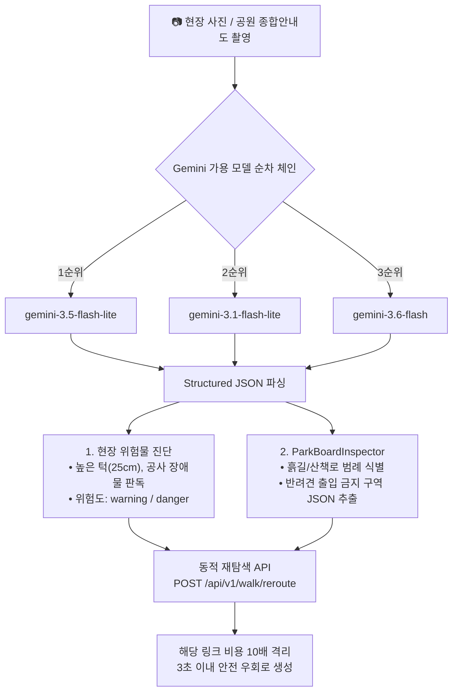
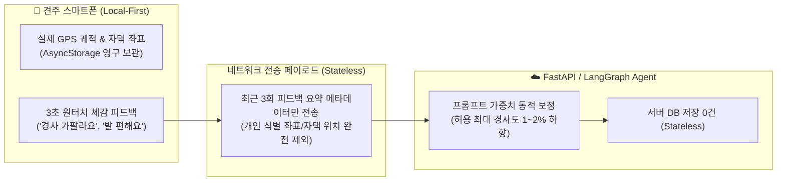

# 🧠 [편하개] AI 문제 정의서 (AI Problem Definition)

> **프로젝트 명칭**: 편하개 (AI Native 반려견 맞춤형 안심 노면 산책 에이전트 및 핸즈프리 모바일 플랫폼)  
> **기준 문서**: [`03_편하개_Agile_User_Stories.md`](file:///d:/cody/pet_walk_t01/docs/03_편하개_Agile_User_Stories.md), [`02_편하개_Team_building.md`](file:///d:/cody/pet_walk_t01/docs/02_편하개_Team_building.md)  
> **작성 일자**: 2026-10-06  
> **문서 목적**: 편하개 프로젝트에서 AI 기술(LLM Agent, Multimodal Vision, 다요소 공간 스코어링, 지능형 피드백 보정)을 통해 해결하고자 하는 핵심 문제 영역과 기술적 솔루션을 정의한다.

---

## 📌 1. 프로젝트 배경 및 문제 제기

반려견 산책은 반려견의 신체적·정서적 웰빙을 위한 필수 일과이지만, 현재 견주들이 겪는 실제 산책 환경은 수많은 물리적 위험과 기술적 단절에 직면해 있습니다.

### 1.1 기존 산책 및 내비게이션 솔루션의 4대 한계
1. **반려견 신체 특성 배제 (Species Blindness)**:
   - 일반 지도(네이버, 카카오, 구글)는 성인 인간의 보행 속도(4~5 km/h)를 기준으로 설계되어 있어 소형견(2.8 km/h), 노령견(2.2 km/h)의 체급별 페이스를 반영하지 못합니다.
   - 계단, 급경사, 뜨거운 지면 등 반려견 관절과 발바닥에 치명적인 요소가 경로 알고리즘에서 전혀 고려되지 않습니다.
2. **화면 주시 강요에 따른 안전사고 위험 (Visual Distraction Hazard)**:
   - 한 손에 리드줄을 쥐고 다른 손으로 스마트폰 지도를 보며 걷는 방식은 자전거, 타 반려견, 킥보드 등 돌발 위험 대처를 늦춰 전방 주시 태만 사고를 유발합니다.
3. **경직된 UI 필터와 의도 표현의 괴리 (Friction in Context Formulation)**:
   - 견주의 실제 요구(*"9살 말티즈라 계단 피하고 완만한 길로 20분만 가볍게 돌고 싶어"*)는 복잡한 맥락을 띠고 있으나, 기존 앱은 다중 드롭다운/슬라이더를 일일이 손으로 조작하도록 강요합니다.
4. **지도 데이터의 정적 결측치와 현장 괴리 (Static Map vs Dynamic Field Reality)**:
   - 공공 지도 데이터에는 현장의 높은 턱(20cm+), 임시 공사 장애물, 공원 내 반려견 출입 금지 구역의 최신 현황이 반영되어 있지 않아 산책 중 낭패를 겪습니다.

---

## 🎯 2. 편하개 앱이 AI를 통해 해결하고자 하는 5대 핵심 문제

편하개는 바닥부터 GIS 알고리즘을 직접 코딩하는 대신, **"사용자 문제를 정밀 정의하고 AI Agent가 외부 도구(Routing Adapter, Steps, DEM, Shade, Vision)를 자율 제어해 해결하는 역량"**에 집중합니다.

| 문제 번호 | 해결 대상 핵심 문제 (Problem) | AI 기반 솔루션 및 기술 접근 (AI Solution) | 연계 애자일 스토리 |
|:---:|---|---|:---:|
| **문제 1** | **복잡한 자연어 산책 요구와 다차원 제약 조건의 구조화 괴리** | **LangGraph ReAct Walk Planning Agent** • 자연어 의도 파싱 및 Pydantic Strict 스키마 추출 • 로컬 프로필 결합 및 무상태(Stateless) 맥락 주입 | [`US-A1`](file:///d:/cody/pet_walk_t01/docs/03_편하개_Agile_User_Stories.md#L50-L64) |
| **문제 2** | **체급·노령견 맞춤 보행 속도 모델링 및 시간 오차 수렴** | **체급별 적응형 시간-거리 환산 모델** • 소형/중형/대형/노령견 표준 속도 상수 적용 • 목표 시간 대비 $\pm 15\%$ 오차 수렴 웨이포인트 튜닝 | [`US-A3`](file:///d:/cody/pet_walk_t01/docs/03_편하개_Agile_User_Stories.md#L80-L94) |
| **문제 3** | **관절 충격(계단/급경사) 및 땡볕 노출 없는 안심 순환 경로 부재** | **다요소 공간 분석 & Candidate Route Scorer** • OSM `steps` 하드 회피 + DEM 경사도 3배 페널티 • SunCalc 태양 궤적 피크 시간대 그늘길 할인 • 다요소 100점 만점 최적 후보 선정 | [`US-B1`](file:///d:/cody/pet_walk_t01/docs/03_편하개_Agile_User_Stories.md#L99-L112) [`US-B2`](file:///d:/cody/pet_walk_t01/docs/03_편하개_Agile_User_Stories.md#L113-L126) [`US-B3`](file:///d:/cody/pet_walk_t01/docs/03_편하개_Agile_User_Stories.md#L127-L140) [`US-B4`](file:///d:/cody/pet_walk_t01/docs/03_편하개_Agile_User_Stories.md#L141-L154) |
| **문제 4** | **정적 지도의 결측치(현장 턱·장애물·공원 안내판 출입 금지 구역)** | **Gemini Cascading Vision AI Pipeline** • Gemini Flash 체인 기반 현장 턱/장애물 분석 • `ParkBoardInspector`: 공원 안내도 비전 판독 및 반려견 금지 구역 JSON 추출 • 현장 위험 10배 비용 격리 및 3초 이내 동적 우회로 재산출 | [`US-D1`](file:///d:/cody/pet_walk_t01/docs/03_편하개_Agile_User_Stories.md#L191-L206) [`US-D2`](file:///d:/cody/pet_walk_t01/docs/03_편하개_Agile_User_Stories.md#L207-L220) |
| **문제 5** | **개인화 추천의 필요성과 프라이버시 침해(자택 동선 유출) 간의 상충** | **Local-First & Stateless Adaptive Feedback AI** • 상세 궤적·자택 좌표는 모바일 `AsyncStorage` 전용 보관 • 최근 3회 피드백 페이로드 기반 무상태 프롬프트 가중치 보정 • 커뮤니티 공유 시 출발지 200m 공간 지터링 마스킹 | [`US-E1`](file:///d:/cody/pet_walk_t01/docs/03_편하개_Agile_User_Stories.md#L225-L238) [`US-E3`](file:///d:/cody/pet_walk_t01/docs/03_편하개_Agile_User_Stories.md#L252-L266) [`US-G2`](file:///d:/cody/pet_walk_t01/docs/03_편하개_Agile_User_Stories.md#L298-L312) |

---

## 🔬 3. 세부 문제별 AI 메커니즘 및 아키텍처 상세

### 3.1 [문제 1] 대화형 자연어 산책 요청의 정밀 구조화 (US-A1)

견주는 산책 조건을 정형화된 서식으로 생각하지 않습니다. *"날이 더우니 그늘 많은 곳으로 30분 정도만 완만하게 걷자"*라는 모호하고 복합적인 자연어 질의를 시스템이 이해할 수 있는 엄격한 제약조건으로 치환해야 합니다.

- **기술 구현**:
  - `LangGraph` 기반 ReAct 상태 머신 오케스트레이션.
  - `WalkIntent` Pydantic 스키마: `target_duration` (10~90분), `avoid_stairs` (bool), `slope_preference` (gentle / very_gentle / none), `shade_priority` (high / normal).
  - 정확도 목표: 자연어 질의 10종에 대해 엔티티 추출 정확도 **85% 이상**.

---

### 3.2 [문제 2 & 3] 다요소 제약 기반 안심 순환 경로 생성 및 스코어링 (US-A3, US-B1~B4)

일반 최단거리 알고리즘은 가파른 계단이나 지옥 같은 오르막길, 땡볕 아스팔트로 안내하기 십상입니다. 편하개는 GIS 외부 어댑터와 다요소 분석 파이프라인을 결합하여 복합적인 안전 코스를 계산합니다.

- **체급별 보행 속도 모델링 (`US-A3`)**:
  - 소형견: $2.8\text{ km/h}$ ($46.7\text{ m/min}$)
  - 중형견: $3.6\text{ km/h}$ ($60.0\text{ m/min}$)
  - 대형견: $4.2\text{ km/h}$ ($70.0\text{ m/min}$)
  - 노령견: $2.2\text{ km/h}$ ($36.7\text{ m/min}$)
  - 목표 시간 대비 $\pm 15\%$ 이내로 수렴하도록 웨이포인트 거리 동적 보정.
- **다요소 채점 수식 (`US-B4`)**:
  $$\text{Safety Score} = S_{\text{stairs}}(30) + S_{\text{slope}}(30) + S_{\text{shade}}(20) + S_{\text{duration}}(20)$$
  - 계단 배제 여부, 평균/최대 경사도, 예상 그늘 비율(`shade_ratio`), 목표 시간 수렴도를 합산하여 최고 득점 코스 선정.

---

### 3.3 [문제 4] 현장 시각 위험 분석 & 공원 종합안내판 비전 판독 (US-D1, US-D2)

수치 지도에는 드러나지 않는 현장의 물리적 위험 요소(턱, 계단 공사)와 법적·행정적 제약(공원 내 반려견 금지 구역)을 시각 인공지능으로 즉시 진단합니다.

- **Gemini Cascading Fallback 전략**:
  - API 가용성 및 레이턴시 보장을 위해 3.5 Flash-Lite ➔ 3.1 Flash-Lite ➔ 3.6 Flash 순으로 순차 폴백하며, 구형 1.5 계열은 성능/품질 보장을 위해 배제.
- **안내판 비전 판독 (`ParkBoardInspector`)**:
  - 공원 입구 오프라인 종합안내도를 촬영하면 어린이 놀이터, 생태연못 등 반려견 출입 금지 구역을 구조화 좌표/영역으로 파싱하여 라우팅 금지 노드로 자동 격리.
- **동적 안전 우회 (`US-D2`)**:
  - 위험 지점 발생 시 해당 도로 링크 가중치를 10배 페널티로 상향하여 3초 이내 즉각적인 우회 경로 재산출 및 음성 브리핑 연계.

---

### 3.4 [문제 5] 프라이버시 보호형 무상태(Stateless) AI 피드백 루프 (US-E1, US-E3, US-G2)

개인화 추천 시스템은 일반적으로 서버에 대량의 사용자 데이터를 수집합니다. 하지만 반려견 산책 궤적과 자택 위치는 심각한 프라이버시 침해 위험을 내포합니다. 편하개는 **Local-First 저장과 Stateless AI 오케스트레이션**으로 이 난제를 해결합니다.

- **Local-First 무결성**:
  - 반려견 프로필, 상세 보행 GPS 궤적은 서버로 1바이트도 전송되지 않으며 로컬 스토리지(`AsyncStorage`)에만 보관.
- **무상태(Stateless) AI 추천 보정 (`US-E3`)**:
  - 사용자가 "지난 코스는 조금 가팔랐어"라고 평가하면, 다음 산책 요청 시 클라이언트가 `"slope_negative_count": 1` 메타데이터만 단발성으로 전송.
  - AI 에이전트는 이를 감지하여 허용 최대 경사도를 1~2% 즉시 하향 조정하여 추천 코스를 산출.
- **공간 지터링 (`US-G2`)**:
  - 커뮤니티 코스 공유 시 출발/도착지 반경 **200m 공간 절단 및 블러링(Spatial Jittering)**을 강제 적용하여 자택 위치 노출 원천 차단.

---

## 🚀 4. 차기 확장 백로그(Phase 2)에서의 AI 문제 해결 영역

1차 MVP(18개 스토리) 완수 후 후속 단계(US-17 ~ US-29)에서 AI가 다룰 확장 문제 영역입니다.

1. **예민견·사회화 취약견을 위한 역발상 한적한 코스 추천 (`US-20`)**:
   - 일반적인 '인기 코스' 추천과 반대로, 통행량 혼잡 밀집도 역가중치 및 사각지대(Blind Corner) 회피, 도로 폭 3m 이상 시야 확보 경로를 탐색.
2. **돌발 상황 긴급 귀환 AI 라우팅 (`US-22`)**:
   - 반려견 부상, 기상 악화 시 현 위치에서 출발점까지 2초 이내 복귀하는 최단·완만 귀환 경로 동적 생성.
3. **다견 가구(Multi-Dog) 복합 제약 절충 모델 (`US-24`)**:
   - 서로 다른 체급과 건강 상태의 반려견 동시 산책 시 최솟값 속도($V_{\min}$)와 가장 보수적인 노면/계단 회피 제약을 자동 결합.
4. **기상청 연동 진흙탕 노면 동적 예측 (`US-26`)**:
   - 최근 24시간 강수량 $\ge 10\text{mm}$ 분석 기반 비포장 흙길 비용 3배 페널티 부여 및 탄성/포장 대안 추천.

---

## 📊 5. AI 기능 정량적 성공 지표 및 검증 기준 (DoD 정합)

편하개 AI 엔진은 정성적인 기대치에 의존하지 않고, 전체 TDD 테스트 스위트([`test_case/`](file:///d:/cody/pet_walk_t01/test_case/README.md))를 통해 검증된 정량 지표를 준수합니다.

| 검증 영역 | 정량 목표 지표 | 검증 방식 및 테스트 모듈 |
|---|:---:|---|
| **자연어 의도 파싱** | **정확도 85% 이상** | 테스트 질의 10종 대상 Pydantic 스키마 변환 단위 테스트 ([`test_walk_plan_agent_schema.py`](file:///d:/cody/pet_walk_t01/test_case/test_walk_plan_agent_schema.py)) |
| **목표 시간 수렴도** | **목표 시간의 $\pm 15\%$ 이내** | 체급별 속도 상수 환산 및 10개 좌표 샘플 순환 코스 시간 오차 검증 ([`test_loop_target_duration.py`](file:///d:/cody/pet_walk_t01/test_case/test_loop_target_duration.py)) |
| **후보 경로 생성 속도** | **1.5초 이내** | Routing Adapter 후보 순환 경로 3종 수집 레이턴시 벤치마크 |
| **비전 위험물/안내판 판독** | **성공률 85% 이상** | 현장 장애물 및 안내판 이미지 20장 대상 Structured JSON 응답 검증 ([`test_vision_safety_inspector.py`](file:///d:/cody/pet_walk_t01/test_case/test_vision_safety_inspector.py)) |
| **동적 우회 재탐색 속도** | **3.0초 이내** | 위험 좌표 주입 시 가중치 10배 격리 및 안전 우회로 재산출 E2E 테스트 |
| **핸즈프리 음성 브리핑** | **회전 30m 전 알림** | 백그라운드 GPS 위치와 OSRM 스텝 매칭 실기기 타이밍 검증 ([`test_mobile_and_voice_navigation.py`](file:///d:/cody/pet_walk_t01/test_case/test_mobile_and_voice_navigation.py)) |
| **프라이버시 무결성** | **서버 전송 0건 / 200m 마스킹** | 자택 좌표 서버 미전송 보장 및 커뮤니티 공간 절단 알고리즘 검증 ([`test_api_contracts.py`](file:///d:/cody/pet_walk_t01/test_case/test_api_contracts.py)) |

---

## 💡 6. 요약: 편하개 AI의 핵심 차별화 가치

> **"오버엔지니어링(직접 GIS 엔진/CV 개발)을 배제하고, AI Agent의 외부 도구 제어력과 Local-First 프라이버시 설계를 통해 실사용자 견주와 반려견에게 진정한 '시선과 관절의 자유'를 제공한다."**

1. **AI Native 오케스트레이션**: LLM(LangGraph ReAct)이 사용자의 말 한마디에서 의도를 파악하고 전문 GIS 도구(ORS, DEM, SunCalc)와 Vision 모델(Gemini Flash)을 유기적으로 지휘.
2. **시선 해방(Eyes-Free) 안전성**: 화면을 끈 주머니 속에서도 끊기지 않는 실시간 음성 브리핑으로 견주가 반려견에게만 온전히 집중할 수 있는 환경 구현.
3. **지속 가능한 데이터 안전(Privacy by Design)**: 가장 개인적인 반려견 건강 정보와 산책 동선을 클라우드 해킹 위험으로부터 100% 격리하면서도 점진적 개인화를 실현하는 스마트한 무상태 아키텍처.
