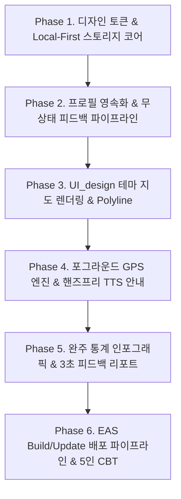

# [구현 계획서] 편안하개 앱 (김승현) 모바일 앱·GPS·음성 안내 구현 계획서

본 문서는 **편안하개** 프로젝트의 `UI_design`에 정의된 디자인 시스템(컬러, 폰트, 카드, 인터랙션)을 기반으로, `docs/03_편안하개_Agile_User_Stories.md`에 명세된 **4번 김승현(앱) (모바일 앱·GPS·음성 안내 전담 / Frontend & Mobile App Lead)**의 사용자 스토리를 성공적으로 구현하기 위한 상세 엔지니어링 구현 계획서이다.

---

## 1. 개요 및 담당 역할 정의

* **담당자**: **4번 김승현(앱)** (Frontend & Mobile App Lead)
* **주요 R&R**: 
  - React Native (Expo SDK 51+) 모바일 클라이언트 아키텍처 구축
  - Local-First 영속성 스토리지(`AsyncStorage`) 설계 및 민감정보 보호
  - React Native Maps 기반 무장애·노면·지면온도 Polyline 분기 렌더링
  - Android Foreground Service 기반 백그라운드 GPS 로깅 엔진 구현
  - `expo-speech` 기반 시선 해방(Eyes-Free) 핸즈프리 음성 내비게이션
  - EAS Build 1회 APK 패키징 및 EAS Update 무선 OTA 실시간 핫픽스 파이프라인 운용
* **총 개발 규모**: **7개 핵심 사용자 스토리 (Must 6개, Should 1개), 총 24 Story Points** *(Phase 2: US-D2 5 pt 별도)*

---

## 2. `UI_design` 기반 모바일 디자인 시스템 및 토큰 규격

`UI_design/src/App.tsx`의 시각 요소를 React Native 전용 스타일 토큰으로 정의하여 일관된 사용자 경험을 보장한다.

### 2.1 디자인 토큰 (Design Tokens)

```typescript
// src/theme/tokens.ts
export const TOKENS = {
  colors: {
    background: '#F8FAF9',       // 전체 화면 기본 배경 (소프트 민트 그레이)
    surface: '#FFFFFF',          // 카드/서피스 배경
    border: '#F0F5F2',           // 기본 테두리
    
    // 브랜드 컬러
    primary: '#10B981',          // 에메랄드 그린
    primaryDark: '#087F5B',      // 딥 그린 (버튼 그라디언트 끝점)
    primaryLight: '#ECFDF5',     // 칩/뱃지 배경
    primaryMint: '#A7F3D0',      // 칩/뱃지 테두리
    
    // 텍스트 계층
    textMain: '#17211C',         // 헤드라인 및 주요 텍스트 (다크 슬레이트)
    textMuted: '#6B756F',        // 설명 및 보조 텍스트 (슬레이트 그레이)
    
    // 지도 Polyline 분기 색상 (US-C1)
    routeSafe: '#10B981',        // 🌿 완만/저온 안심 구간
    routeNormal: '#3B82F6',      // 🏢 일반 보행로
    routeCaution: '#F97316',     // ⚠️ 급경사/고온/위험 주의 구간
    
    // 초절전 다크 포켓 모드 (US-C2)
    pocketBg: '#000000',         // True Black OLED 절전 배경
    pocketHud: '#10B981',        // HUD 고대비 네온 그린
  },
  borderRadius: {
    frame: 40,                   // 모바일 디바이스 프레임
    card: 20,                    // 카드 컴포넌트
    badge: 20,                   // 칩/뱃지
    button: 14,                  // 메인 액션 버튼
    iconBox: 14,                 // 아이콘 컨테이너
  },
  shadows: {
    card: {
      shadowColor: '#10B981',
      shadowOffset: { width: 0, height: 2 },
      shadowOpacity: 0.10,
      shadowRadius: 16,
      elevation: 3,
    },
    button: {
      shadowColor: '#10B981',
      shadowOffset: { width: 0, height: 4 },
      shadowOpacity: 0.35,
      shadowRadius: 12,
      elevation: 5,
    },
  },
  typography: {
    fontFamily: 'NotoSansKR-Regular',
    fontBold: 'NotoSansKR-Bold',
  }
};
```

### 2.2 웰니스 카피라이팅 원칙
- 앱 전역에서 '슬개골 탈구', '관절염' 등 부정적 질병 용어를 배제한다.
- **순화 표현**: *"관절 안심 케어"*, *"폭신한 길 위주"*, *"오늘도 편안하게, 우리 아이와 걸어요 🐾"*.

---

## 3. 김승현(앱) 담당 사용자 스토리 및 R&R 매핑

### 3.1 핵심 MVP 담당 스토리 (7개 스토리 / 24 pt)

| Story ID | 에픽 (Epic) | 사용자 스토리 명칭 | 역할 및 산출물 | 난이도 | 우선순위 | 포인트 |
|:---:|---|---|---|:---:|:---:|:---:|
| **US-A2** | [Epic A] 산책 조건 입력 | 반려견 프로필 로컬 등록 및 JSON 백업/복원 | `AsyncStorage` CRUD 모듈, JSON 파일 내보내기/불러오기 | 하 | Must | 3 pt |
| **US-C1** | [Epic C] 모바일 UI & 안내 | RN Maps 기반 구간별 색상 분기 경로 시각화 | `react-native-maps` 분기 Polyline 및 코스 요약 바텀시트 | 중 | Must | 5 pt |
| **US-C2** | [Epic C] 모바일 UI & 안내 | 시선 해방(Eyes-Free) 백그라운드 음성 안내 | Android Foreground Service + `expo-speech` TTS 엔진 | 상 | Must | 5 pt |
| **US-E1** | [Epic E] 산책 기록 & Memory | 백그라운드 GPS 위치 추적 및 실산책 로컬 저장 | 화면 꺼짐 무중단 GPS 로깅 + `@편안하개:walk_history` 저장 | 중상 | Must | 5 pt |
| **US-E2** | [Epic E] 산책 기록 & Memory | 산책 종료 후 보행 체감 피드백 및 로컬 통계 | 완주 통계 연산 로직 및 3초 원터치 피드백 데이터 바인딩 | 하 | Must | 3 pt |
| **US-E3** | [Epic E] 산책 기록 & Memory | 누적 피드백 기반 무상태(Stateless) AI 보정 | 최근 3회 피드백 요약 페이로드 추출 및 API 바디 주입 | 중 | Should | 3 pt |
| **US-H1** | [Epic H] 무중단 배포 | EAS Build 1회 배포, EAS Update 무선 OTA & CBT | APK 패키징, `eas update` 무선 핫픽스, 5인 필드 CBT 지원 | 상 | Must | 5 pt |

### 3.2 Phase 2 차기 고도화 연계 스토리

| Story ID | 에픽 (Epic) | 사용자 스토리 명칭 | 역할 및 산출물 | 난이도 | 우선순위 | 포인트 |
|:---:|---|---|---|:---:|:---:|:---:|
| **US-D2** | [Phase 2] 현장 위험 & 재탐색 | 현장 위험 구간 우회 및 동적 재탐색 안내 | 우회 경로 수신 시 실시간 음성/화면 알림 즉시 갱신 | 중상 | Should (Phase 2) | 5 pt |

---

## 4. 단계별 상세 구현 로드맵 (Phase 1 ~ Phase 6)



---

### 📌 Phase 1. 디자인 시스템 포팅 & Local-First 스토리지 기반 구축
* **목표**: `UI_design`의 웹 컴포넌트 규격을 React Native 컴포넌트로 포팅하고, Local-First 스토리지 래퍼를 구축한다.
* **상세 작업**:
  1. **디자인 토큰 및 공통 UI 컴포넌트 포팅 (`src/components/common/`)**:
     - `CardWrapper.tsx`: 테두리 `#F0F5F2` 및 민트 글로우 섀도우 포함 카드.
     - `GradientButton.tsx`: `#10B981` ➔ `#087F5B` 그라디언트 액션 버튼.
     - `StatusBadge.tsx`: `#ECFDF5` 배경, `#A7F3D0` 테두리의 웰니스 칩.
     - `BottomTabBar.tsx`: 5개 탭 (`홈`, `산책`, `+` 중앙 FAB, `커뮤니티`, `마이`) 렌더링.
  2. **Local-First 영속성 스토리지 래퍼 (`src/services/storage.ts`)**:
     - `AsyncStorage`를 래핑하여 제네릭 타입 안정성 확보 (`getItem<T>`, `setItem<T>`, `removeItem`).
     - 키 접두사 관리 (`@편안하개:*`).

---

### 📌 Phase 2. [US-A2 / US-E3] 프로필 로컬 저장 및 무상태(Stateless) AI 컨텍스트 바인딩
* **목표**: 개인정보의 서버 전송을 원천 차단하고, 최근 산책 피드백을 무상태로 AI 요청에 주입한다.
* **상세 작업**:
  1. **반려견 프로필 로컬 모델 (`src/types/dogProfile.ts`)**:
     ```typescript
     export interface DogProfile {
       id: string;
       name: string;            // 예: '초코'
       breed: string;           // 예: '말티즈'
       ageYears: number;        // 예: 9
       weightKg: number;        // 예: 4.2
       jointCareLevel: 0 | 1 | 2; // 관절 안심 케어 (0: 일반, 1: 주의, 2: 적극보호)
       speedKmH: number;        // 체급/연령 환산 속도 (예: 2.2 km/h)
       photoUri?: string;
     }
     ```
  2. **JSON 백업/복원 엔진 (`src/services/backupService.ts`)**:
     - `expo-file-system` 및 `expo-sharing`을 사용하여 로컬 JSON 파일 내보내기/가져오기 구현.
  3. **무상태 피드백 컨텍스트 추출기 (`src/services/feedbackContext.ts`) (US-E3)**:
     - `@편안하개:walk_history`에서 최근 3회 기록을 조회하여 피드백 요약본 생성:
       ```json
       {
         "recent_feedback_summary": {
           "slope_dissatisfied_count": 1,
           "shade_preferred": true,
           "avg_joint_comfort_score": 4.2
         }
       }
       ```
     - AI 경로 생성 API 호출 시 요청 본문(`WalkIntentRequest`)에 동적 결합.

---

### 📌 Phase 3. [US-C1] `UI_design` 테마 지도 렌더링 & 구간별 Polyline 분기
* **목표**: 코스의 속성(완만/그늘, 일반, 주의 구간)을 지도 위 색상 분기로 시각화한다.
* **상세 작업**:
  1. **구간별 분기 Polyline 렌더러 (`src/components/map/RoutePolylineRenderer.tsx`)**:
     - 서버 응답 GeoJSON 내 각 세그먼트의 `property`를 판별하여 분기 렌더링:
       - `safe` (완만/그늘): 색상 `#10B981`, 두께 `6`, `strokeLinecap: 'round'`
       - `normal` (일반 보도): 색상 `#3B82F6`, 두께 `5`
       - `caution` (급경사/턱 주의): 색상 `#F97316`, 두께 `6`
  2. **마커 및 핀 커스텀 렌더링 (`src/components/map/CustomMarkers.tsx`)**:
     - 출발지/도착지: `UI_design` 초록 발자국(Paw) 원형 마커.
     - 회전 및 안내 스텝 핀.
  3. **코스 요약 바텀시트 카드 (`src/components/map/CourseSummaryCard.tsx`)**:
     - 하단 엄지 영역(Thumb Zone) 배치.
     - 총 거리(km), 예상 시간(분), 최대 경사도(%), 그늘 비율(%) 인포칩 표시.
     - "산책 시작 →" 그라디언트 버튼 인터랙션.

---

### 📌 Phase 4. [US-C2 / US-E1 / US-D2] 포그라운드 GPS & 시선 해방(Eyes-Free) TTS 안내
* **목표**: 화면이 꺼져도 중단 없는 고정밀 GPS 로깅과 30m 전 사전 음성 길 안내를 구현한다.
* **상세 작업**:
  1. **Android Foreground Service 위치 추적 엔진 (`src/services/locationService.ts`) (US-E1)**:
     - `expo-location`의 `startLocationUpdatesAsync`를 백그라운드 태스크 등록 (`TaskManager.defineTask`).
     - 포그라운드 노티피케이션 구성: *"🐾 편안하개 안심 산책 중: {distance}km / {duration}분"*.
     - 백그라운드 상태에서 수집된 GPS 좌표(`latitude, longitude, timestamp`)를 인메모리 버퍼에 연속 기록.
  2. **시선 해방(Eyes-Free) TTS 안내 엔진 (`src/services/ttsNavigation.ts`) (US-C2)**:
     - `expo-speech` 모듈 연동 (한국어 음성 프리셋 적용).
     - 현재 GPS와 다음 OSRM 스텝 좌표 간 거리(Haversine) 실시간 비교:
       - **30m 전 사전 브리핑**: *"50m 앞 완만한 길입니다. 우회전하세요."*
       - **위험 지점 사전 브리핑**: *"전방 높은 턱 주의 구간입니다. 서행하세요."*
       - **40m 이상 이탈 감지 시**: 부드러운 차임벨 + *"경로를 이탈했습니다. 안전하게 안내를 재탐색합니다."*
  3. **동적 위험 우회 알림 연동 (US-D2)**:
     - 2번 전황진(데이터) / 3번 노희선(서버) 담당자의 우회 경로 수신 시, 지도 Polyline 즉시 교체 및 음성 브리핑 송출:
       *"전방 턱 구간을 우회하여 새로운 완만길로 안내합니다."*
  4. **초절전 다크 포켓 모드 (`src/screens/DarkPocketScreen.tsx`)**:
     - 주머니 속 배터리 소모를 극소화하는 `#000000` True Black UI.
     - 고대비 네온 그린 HUD (시간, 거리, 현재 속도).
     - 오터치 방지 '밀어서 잠금 해제(Slide to Unlock)' 제스처 인터랙션.

---

### 📌 Phase 5. [US-E1 / US-E2] 완주 기록 영구 저장 & 3초 인포그래픽 리포트
* **목표**: 산책 완주 시 GPS 궤적을 폰에 저장하고, 인포그래픽 카드와 3초 피드백 폼을 제공한다.
* **상세 작업**:
  1. **산책 종료 처리 및 영구 저장 (`@편안하개:walk_history`) (US-E1)**:
     - 포그라운드 GPS 서비스 안전 종료.
     - 궤적 데이터, 총 이동 거리, 소요 시간, 평균 속도, 완만길 달성률을 로컬 스토리지에 Push.
     - 최근 100회 산책 기록 보관 정책 및 용량 최적화.
  2. **완주 인포그래픽 리포트 화면 (`src/screens/WalkReportScreen.tsx`) (US-E2)**:
     - `UI_design` 스타일 축하 배너: *"WALK COMPLETE! 오늘 산책을 무사히 마쳤어요 🐾"*.
     - 계획 경로 대비 실제 걸은 궤적 지도 오버레이 표시.
     - 핵심 보행 통계 카드 렌더링.
  3. **3초 원터치 피드백 모달 (`src/components/feedback/QuickFeedbackModal.tsx`)**:
     - 원터치 칩: `[👍 완만해요]`, `[🌳 그늘 많아요]`, `[🐾 발이 편해요]`.
     - 5점 만족도 슬라이더.
     - 피드백 데이터를 즉시 해당 산책 기록 메타데이터에 바인딩.

---

### 📌 Phase 6. [US-H1] 무중단 배포 (EAS Build/Update) & 5인 현장 CBT
* **목표**: 스토어 재심사나 수동 APK 재설치 없이 `eas update` 무선 OTA로 실시간 핫픽스를 배포한다.
* **상세 작업**:
  1. **EAS 설정 (`eas.json`) 구성**:
     - 테스터용 Android APK 1회 패키징 (`preview` 프로필).
     - `expo-updates` 연동 및 런타임 버전 고정.
  2. **무선 실시간 핫픽스 파이프라인**:
     - 코드 및 UI 수정 시 즉시 무선 배포:
       ```bash
       eas update --branch preview --message "fix: GPS background smoothing and TTS voice briefing"
       ```
     - 앱 기동 시 원격 업데이트 자동 확인 및 무점검 무중단 핫픽스 반영.
  3. **5인 필드 테스터 CBT 지원**:
     - 화면 꺼짐 상태에서 음성 안내 타이밍(30m 전) 정확도 검증.
     - 주머니 속 배터리 소모율 실측 데이터 로깅 및 가중치 튜닝.

---

## 5. 스프린트 주차별 작업 일정표 (5주)

| 기간 | 주요 작업 내용 | 연계 산출물 | 완료 기준 (DoD) |
|---|---|---|---|
| **Sprint 1 (W1~W2)** | • 디자인 토큰/공통 UI 포팅<br/>• `AsyncStorage` 프로필 CRUD & 백업<br/>• React Native Maps 분기 Polyline 구현 | `tokens.ts`<br/>`storage.ts`<br/>`RoutePolylineRenderer.tsx` | • 프로필 로컬 CRUD 및 JSON 백업 통과<br/>• 3색 Polyline 지도 렌더링 UI 검증 |
| **Sprint 2 (W3~W4)** | • Android Foreground GPS 엔진<br/>• `expo-speech` 30m 사전 음성 안내<br/>• 다크 포켓 모드 HUD<br/>• 완주 통계 & 3초 피드백 리포트 | `locationService.ts`<br/>`ttsNavigation.ts`<br/>`DarkPocketScreen.tsx`<br/>`WalkReportScreen.tsx` | • 화면 꺼짐 상태 무중단 GPS 로깅 통과<br/>• 30m 전 음성 안내 타이밍 검증<br/>• 산책 종료 후 로컬 스토리지 무결성 검증 |
| **Final (W5)** | • EAS Build 테스터 APK 1회 패키징<br/>• EAS Update 무선 OTA 배포 파이프라인<br/>• 5인 견주 필드 CBT 및 핫픽스 반영 | `eas.json`<br/>EAS 배포 파이프라인<br/>CBT 피드백 보고서 | • 무선 OTA 실기기 핫픽스 반영 확인<br/>• 5인 CBT 현장 테스트 완료 |

---

## 6. 완료 정의 (Definition of Done, DoD) 체크리스트

- [ ] **디자인 정합성**: `UI_design`의 주요 색상(`#10B981`, `#F8FAF9`, `#17211C`), 카드 라운딩(`20px`), 그림자가 모바일 화면에서 일관되게 렌더링되는가?
- [ ] **Local-First 원칙**: 견주 프로필과 상세 보행 GPS 좌표가 서버 DB로 유출되지 않고 오직 기기 로컬 스토리지(`AsyncStorage`)에만 보관되는가?
- [ ] **백그라운드 지속성**: 화면이 꺼진(Lock Screen) 상태에서도 Android Foreground Service가 종료되지 않고 100% 무중단 GPS 위치를 수집하는가?
- [ ] **핸즈프리 정확도**: 회전 구간 30m 전에 부드러운 한국어 음성으로 방향과 노면 주의 사항이 정확히 발화되는가?
- [ ] **무중단 핫픽스**: `eas update` 배포 후 앱을 재기동했을 때 APK 재설치 없이 최신 코드가 즉각 반영되는가?
- [ ] **카피라이팅 검증**: 앱 화면 전역에서 질병 용어가 0건 검출되고 긍정적 웰니스 용어가 사용되었는가?
