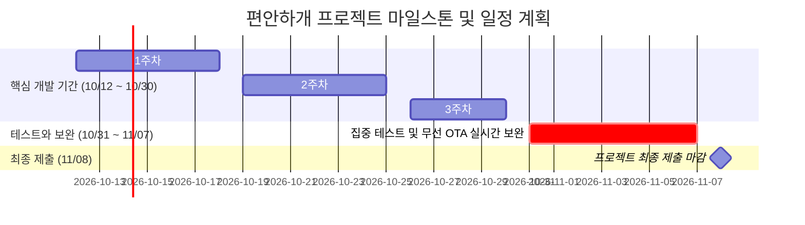

# 📅 [수행 계획서] 편안하개 프로젝트 수행 기간 및 주차별 팀원 R&R 계획서

본 문서는 **편안하개 (AI Native 반려견 맞춤형 안심 노면 산책 에이전트 및 핸즈프리 모바일 플랫폼)**의 **10월 12일 프로젝트 시작**, **10월 30일 개발 마감(Code Freeze)**, **10월 31일 ~ 11월 7일 집중 테스트와 보완**, 그리고 **11월 8일 최종 제출 마감**을 완수하기 위한 주차별 팀원 전담 업무 수행 계획서이다.

---

## 📌 1. 프로젝트 주요 마일스톤 (Milestones)

| 마일스톤 단계 | 일정 | 주요 목표 및 산출물 | 책임 |
|---|:---:|---|:---:|
| **프로젝트 킥오프** | **10월 12일 (월)** | • 5인 팀원별 전담 업무 착수 및 스프린트 1 가동 • 기획/아키텍처/TDD 환경 기반 코어 개발 돌입 | 5인 전원 |
| **개발 마감 (Code Freeze)** | **10월 30일 (금)** | • 전 기능 구현 완료 (AI, GIS, 서버, 앱, UI) • EAS Build 테스터용 APK 1회 패키징 완료 | 5인 전원 |
| **집중 테스트와 보완 (Test & Refine)** | **10월 31일 (토) ~ 11월 7일 (토)** | • 최소 5인 실사용자 필드 산책 현장 테스트(CBT) • 주머니 속 핸즈프리 음성 안내 및 계단 회피 체감 검증 • EAS Update (`expo-updates`) 무선 OTA 실시간 핫픽스 및 보완 • 피드백 수집 기반 가중치 미세 튜닝 및 완성도 극대화 | Lead: 김정님(UI/QA) & 5인 전원 |
| **최종 제출 마감 (Final Submission)** | **11월 8일 (일)** | • 프로젝트 최종 산출물 및 GitHub 코드베이스 제출 • 최종 발표 PPT 및 데모 시연 영상 제출 | Lead: 조현정(팀장) & 5인 전원 |

---

## 📊 2. 프로젝트 일정 타임라인 (Gantt Chart)

---

## 👥 3. 주차별 팀원별 전담 해야 할 일 (Weekly R&R)

### 1주차 (10월 12일 ~ 10월 18일): 프로젝트 킥오프 & 코어 기반 구축 (Sprint 1)
* **조현정 (팀장 / PM & AI Agent Lead)**
  - LangGraph ReAct 상태 머신(`StateGraph`) 노드 구현 및 워크플로우 빌드.
  - 자연어 의도 파싱(`WalkIntent`) Pydantic V2 Strict Schema 검증 및 불명확 질의 Fallback 구현.
  - 체급별(소형/중형/대형/노령견) 표준 보행 속도 상수 및 목표 시간-거리 환산 모델 연동.
* **전황진 (데이터 / AI & Spatial Data Engineer)**
  - OSM 보행 네트워크 계단(`highway=steps`) 및 단차 링크 필터링 파이프라인 구축.
  - 수치표고모델(DEM) 고도 래스터 기반 링크별 종단 경사각(15도 미만) 산출 로직 구현.
* **노희선 (서버 / Backend & Spatial Routing Lead)**
  - FastAPI 무상태 코어 라우팅 엔드포인트(`POST /api/v1/walk/plan`) 구현.
  - Routing API Adapter 연동을 통한 기본 순환 루프 후보(2~3개) 생성 API 개발.
* **김승현 (앱 / Frontend & Mobile App Lead)**
  - React Native (Expo SDK 51+) 네비게이션 구조 구축 (온보딩 $\to$ 플래너 $\to$ 지도 프리뷰).
  - Local-First 영속 스토리지(`AsyncStorage`) 모듈 개발 (반려견 프로필 CRUD, JSON 백업/복원).
  - `react-native-maps` 기본 지도 컴포넌트 렌더링.
* **김정님 (UI / UI/UX Designer & Product Experience Lead)**
  - 편안하개 디자인 시스템(컬러 토큰, 시인성 규격) 및 온보딩 반려견 프로필 입력 UI 개발.
  - 산책 플래너 슬라이더/칩 인터랙션 UI 컴포넌트 개발.

---

### 2주차 (10월 19일 ~ 10월 25일): 핵심 차별화 기능 결합 & 백그라운드 내비게이션 (Sprint 2)
* **조현정 (팀장)**
  - Candidate Route Scorer 100점 만점 채점 알고리즘 결합 (계단 30점 + 경사 30점 + 열안전 20점 + 거리 20점).
  - 클라이언트 최근 피드백(`too_steep`) 연동 무상태(Stateless) 허용 경사도 1~2%p 하향 보정 엔진 구현.
* **전황진 (데이터)**
  - 기상청 단기예보(기온, 일사량) 연동 지면온도 추정 모델(35℃ 초과 고온 노면 회피) 파이프라인 개발.
  - 전국 공영주차장 API 클라이언트 및 거점 연계 P&R 데이터 가공.
* **노희선 (서버)**
  - 무장애길 하드 제약(계단 배제) 및 지면온도 페널티 가중치 라우팅 비용 함수 구현.
  - Supabase Auth 기반 간편 이메일 가입/로그인 및 공개 코스 피드 API 개발.
* **김승현 (앱)**
  - Android Foreground Service 기반 화면 꺼짐 무중단 GPS 로깅 엔진 개발.
  - `expo-speech` 회전 30m 전 사전 음성 안내 브리핑 엔진 개발.
  - 지도 위 구간별 색상 분기 Polyline(🌿 완만, 🏢 일반, ⚠️ 주의) 렌더링.
* **김정님 (UI)**
  - 주머니 속 배터리 소모를 극소화하는 **'초절전 다크 포켓 모드'** UI 개발.
  - 산책 완주 인포그래픽 리포트 화면 및 3초 원터치 체감 피드백 UI 완성.

---

### 3주차 (10월 26일 ~ 10월 30일): 전체 기능 통합, 패키징 & 개발 마감 (Code Freeze)
> 🚨 **10월 30일(금) 마일스톤: 코드 프리즈 (Code Freeze) & 테스트용 APK 단 1회 패키징 완료**

* **조현정 (팀장)**
  - LangGraph 에이전트와 백엔드/클라이언트 전주기 E2E 오케스트레이션 통합 검증.
  - 순환 경로 목표 시간 수렴도($\pm 15\%$) 튜닝 및 TDD 100개 테스트 전수 통과 확인.
  - 필드 테스트(CBT) 시나리오 점검 및 성공 기준 확정.
* **전황진 (데이터)**
  - 코스 커뮤니티 공유 시 출발지/도착지 200m 공간 지터링 마스킹 알고리즘 통합 검증.
  - 실시간 기상/노면 데이터 캐시 파이프라인 안정화.
* **노희선 (서버)**
  - 백엔드 REST API v1 전체 통합 검증 및 에러 핸들링 점검.
  - API 레이턴시 최적화(1.5초 이내) 및 무중단 서버 배포 환경 점검.
* **김승현 (앱)**
  - **EAS Build로 Android 테스터용 APK 단 1회 패키징 및 배포 완료.**
  - GitHub Actions 연동 EAS Update (`expo-updates`) 무선 무점검 OTA 파이프라인 연동.
* **김정님 (UI)**
  - 앱 전역 웰니스 카피라이팅 가드레일 전수 감사 (질병 단어 노출 0건 확인).
  - UI 레이아웃/인터랙션 폴리싱 및 5인 필드 테스터용 체크리스트/설문지 제작.

---

### 4주차 (10월 31일 ~ 11월 7일): 집중 테스트와 보완 (Testing & Refinement)
> 🧪 **10월 31일(토) ~ 11월 7일(토): 실사용자 필드 산책 현장 테스트, 무선 OTA 핫픽스 & 완성도 보완**

* **공통 참여 과업**:
  - 개발팀 5인 및 실제 반려견 견주 5인 이상 대상 **실제 야외 필드 산책 현장 테스트 진행**.
  - 화면을 끈 채 스마트폰을 주머니에 넣고 걷는 **시선 해방(Eyes-Free) 핸즈프리 음성 안내** 집중 검증.
  - 계단 회피 및 완만 경사 체감, 고온 노면 회피 정확도 평가.
* **팀원별 테스트 및 보완 전담 역할**:
  * **조현정 (팀장)**:
    - 필드 CBT 정량 피드백 수집 및 분석, Scorer 가중치 미세 튜닝.
    - 최종 발표 자료(PPT) 기획 및 데모 시연 영상 시나리오 작성.
  * **전황진 (데이터)**:
    - 현장 산책로 경사도 체감과 DEM 데이터 간 정합도 검증 및 공간 데이터 보정.
    - 기상청 단기예보 수집 주기 최적화 및 핫픽스 지원.
  * **노희선 (서버)**:
    - 테스트 기간 중 서버 API 트래픽 및 예외 로그 실시간 모니터링.
    - 필드 테스트 중 발견된 엣지케이스 백엔드 패치 및 성능 최적화.
  * **김승현 (앱)**:
    - 필드 테스트 중 발견된 GPS 튀김 및 음성 타이밍 이슈에 대해 **`eas update` 무선 OTA로 실시간 핫픽스 배포**.
    - 앱 안정성 모니터링 및 배포 매니페스트 관리.
  * **김정님 (UI/QA)**:
    - 사용성 평가(Usability Testing) 설문 데이터 분석 및 개선점 도출.
    - UI 버그 픽스 검증, 완주 리포트 인포그래픽 시각화 보완, 최종 데모 화면 녹화.

---

### 최종 마감일: 11월 8일 (일) - 프로젝트 최종 제출 (Final Submission)
* **조현정 (팀장)**: 최종 발표 PPT 완성, 프로젝트 총괄 산출물 최종 승인 및 공식 제출.
* **전황진 (데이터)**: 데이터 파이프라인 및 공간 분석 결과 보고서 정리.
* **노희선 (서버)**: 백엔드 API 명세서 및 서버 실행 가이드 최종본 정리.
* **김승현 (앱)**: 모바일 앱 릴리즈 태깅 및 배포 결과 보고서 취합.
* **김정님 (UI)**: 최종 UI 디자인 산출물, CBT 사용성 평가 보고서 및 데모 시연 영상 최종 렌더링.
* **5인 전원**: 최종 GitHub 리포지토리 PR 머지 및 프로젝트 최종 제출 완료 🏁.
