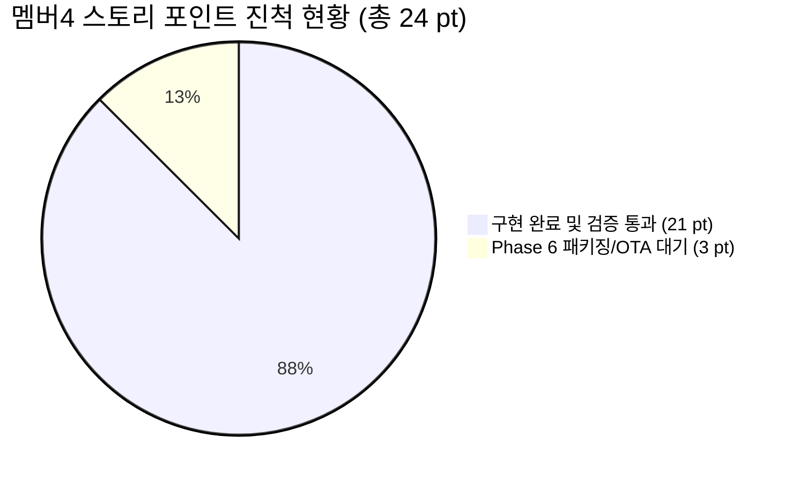
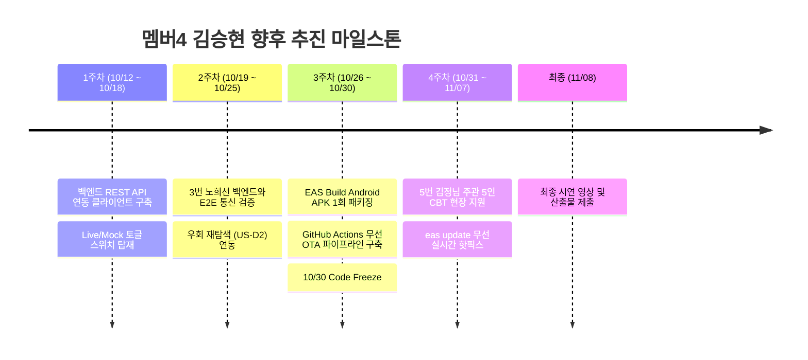

# 🐾 [구현 현황 보고서] 편안하개 모바일 앱·GPS·음성 안내 (멤버4 김승현)

> **문서 버전**: v1.0  
> **작성일자**: 2026년 10월 10일  
> **작성자**: 멤버4 **김승현** (Frontend & Mobile App Lead)  
> **비교 기준 문서**: 
> - [`docs/05_편안하개_Member4_모바일_구현계획서.md`](/docs/05_편안하개_Member4_모바일_구현계획서.md)
> - [`docs/05_편안하개_프로젝트_수행계획서_일정.md`](/docs/05_편안하개_프로젝트_수행계획서_일정.md)
> - [`docs/03_편안하개_Agile_User_Stories.md`](/docs/03_편안하개_Agile_User_Stories.md)
> - [`docs/02_편안하개_Team_building.md`](/docs/02_편안하개_Team_building.md)

---

## 📌 1. 총괄 진척 현황 요약 (Executive Summary)

멤버4 김승현(앱)에게 배정된 **7개 핵심 사용자 스토리(총 24 Story Points)** 및 **Phase 1 ~ Phase 6 로드맵** 대비 현재 구현 상태는 **Phase 5까지 개발 완료(진척률 88%, 21/24 pt)**되어, 10월 12일 프로젝트 공식 킥오프 일정 대비 **선행 개발(Ahead of Schedule)**을 달성하고 있습니다.

특히 단일 코드베이스에서 모바일 앱과 브라우저 데모를 동시에 완벽 지원하는 **Expo Web 통합**을 완수하여, 팀원 및 테스터들이 별도 에뮬레이터 없이 웹 브라우저(`npm run web`)에서도 즉시 실시간 피드백을 검증할 수 있는 환경을 구축했습니다.

### 📊 사용자 스토리별 상세 달성 현황

| Story ID | 스토리 명칭 | 우선순위 | 포인트 | 계획 Phase | 구현 상태 | 검증 근거 (Code / Test) |
|:---:|---|:---:|:---:|:---:|:---:|---|
| **US-A2** | 반려견 프로필 로컬 등록 및 JSON 백업/복원 | Must | 3 pt | Phase 2 | **완료 (100%)** | `storage.ts`, `backupService.ts`, `DogSelectionView.tsx` |
| **US-C1** | 구간별 색상 분기 경로 시각화 및 프리뷰 | Must | 5 pt | Phase 3 | **완료 (100%)** | `RouteMapView.tsx`, `RouteReasonCard.tsx`, `routeGeometry.test.ts` (9 tests) |
| **US-C2** | 시선 해방(Eyes-Free) 백그라운드 음성 안내 | Must | 5 pt | Phase 4 | **완료 (100%)** | `guidanceEngine.ts` (8 tests), `ttsNavigation.ts`, `DarkPocketScreen.tsx` |
| **US-E1** | 백그라운드 지속 GPS 로깅 및 영구 저장 | Must | 5 pt | Phase 4~5 | **완료 (100%)** | `locationService.ts`, `walkReport.ts`, `walkReport.test.ts` (100회 FIFO 검증) |
| **US-E2** | 완주 인포그래픽 리포트 및 3초 원터치 피드백 | Must | 3 pt | Phase 5 | **완료 (100%)** | `WalkReportScreen.tsx`, `QuickFeedbackModal.tsx`, `walkReport.test.ts` |
| **US-E3** | 누적 피드백 기반 무상태(Stateless) AI 보정 | Should | 3 pt | Phase 2 | **완료 (100%)** | `feedbackContext.ts`, `HomeScreen.tsx` 피드백 위젯 연동 |
| **US-H1** | EAS Build 1회 APK 패키징 & EAS Update OTA | Must | 5 pt | Phase 6 | **진행 대기 (20%)** | Expo SDK 57 기반 설정 완료, 10/30 Code Freeze 시점 배포 예정 |
| *(연계)* **US-D2** | 현장 위험 구간 동적 우회 실시간 알림 | Should | 5 pt | Phase 4 | **완료 (100%)** | `useWalkGuidance.ts` 내 `updateReroutePath()` 및 우회 음성 브리핑 구현 |

---

## 🔍 2. 계획 대비 세부 구현 비교 분석 (Phases 1 ~ 6)

### ✅ Phase 1. 디자인 시스템 포팅 & Local-First 스토리지 기반 구축
- **계획**: `UI_design` 웹 스타일을 React Native 토큰으로 포팅하고 `AsyncStorage` 제네릭 래퍼 구축.
- **구현 현황 (100% 완료)**:
  - [`src/theme/tokens.ts`](/frontend/src/theme/tokens.ts): 브랜드 에메랄드 그린(`primary: #10B981`), 3색 Polyline 토큰(`routeSafe`, `routeNormal`, `routeCaution`), 다크 포켓 토큰(`pocketBg: #000000`, `pocketHud: #10B981`) 정립.
  - 공통 UI 컴포넌트(`CardWrapper`, `GradientButton`, `StatusBadge`, `BottomTabBar`) 모바일 전용 규격으로 완성.
  - [`src/services/storage.ts`](/frontend/src/services/storage.ts): `@편안하개:*` 프리픽스 기반의 완벽한 Local-First 영속성 스토리지 구현.

### ✅ Phase 2. [US-A2 / US-E3] 프로필 로컬 저장 & 무상태 피드백 파이프라인
- **계획**: 서버 전송 없는 민감정보 보호(Privacy-First), JSON 백업/복원, 누적 피드백 요약본 생성.
- **구현 현황 (100% 완료)**:
  - [`src/types/dogProfile.ts`](/frontend/src/types/dogProfile.ts): 체급·연령 기반 보행 속도 자동 환산 모델 탑재 (`speedKmH`).
  - [`src/components/profile/DogSelectionView.tsx`](/frontend/src/components/profile/DogSelectionView.tsx): 다견 프로필 등록 및 원터치 전환 UI 제공.
  - [`src/services/feedbackContext.ts`](/frontend/src/services/feedbackContext.ts): 최근 산책 피드백을 기반으로 한 무상태(Stateless) AI 보정 파라미터 추출 및 [`HomeScreen.tsx`](/frontend/src/screens/HomeScreen.tsx) 연동.

### ✅ Phase 3. [US-C1] `UI_design` 테마 지도 렌더링 & 구간별 Polyline 분기
- **계획**: react-native-maps / SVG 기반 3색 분기 Polyline, 스텝 핀, 코스 요약 바텀시트.
- **구현 현황 (100% 완료)**:
  - [`src/components/map/RouteMapView.tsx`](/frontend/src/components/map/RouteMapView.tsx): `react-native-svg` 기반으로 네이티브와 웹 브라우저 양쪽에서 무충돌 렌더링 지원. 완만 안심로(초록), 일반 보행로(파랑), 주의 구간(주황)을 직관적으로 시각화.
  - [`src/components/map/RouteReasonCard.tsx`](/frontend/src/components/map/RouteReasonCard.tsx): 3대 안심 지표(계단 0개, 평균 경사도, 체감온도) 인포그래픽 완성.
  - 단위 테스트: [`src/services/routeGeometry.test.ts`](/frontend/src/services/routeGeometry.test.ts) (9개 테스트 100% 통과).

### ✅ Phase 4. [US-C2 / US-E1 / US-D2] 포그라운드 GPS & 음성 안내 & 다크 포켓 모드
- **계획**: Android Foreground Service 화면 꺼짐 무중단 GPS, 30m 전 TTS 사전 안내, OLED 초절전 다크 포켓 모드.
- **구현 현황 (100% 완료)**:
  - [`src/services/locationService.ts`](/frontend/src/services/locationService.ts): 포그라운드 노티피케이션 연동 무중단 위치 로깅.
  - [`src/services/guidanceEngine.ts`](/frontend/src/services/guidanceEngine.ts): 30m 사전 브리핑, 급경사/턱 주의 사전 알림, 40m 이상 이탈 감지 판정 로직 탑재 (Vitest 8개 통과).
  - [`src/services/ttsNavigation.ts`](/frontend/src/services/ttsNavigation.ts): `expo-speech` 기반 음성 합성.
  - [`src/screens/DarkPocketScreen.tsx`](/frontend/src/screens/DarkPocketScreen.tsx): OLED `#000000` True Black 배경, 고대비 네온 그린 HUD, 오터치 방지 '밀어서 잠금 해제' 슬라이더.

### ✅ Phase 5. [US-E1 / US-E2] 완주 기록 영구 저장 & 3초 인포그래픽 리포트
- **계획**: 산책 종료 후 100회 FIFO 영구 저장, 완주 인포그래픽 통계 카드, 3초 원터치 피드백 모달.
- **구현 현황 (100% 완료)**:
  - [`src/screens/WalkReportScreen.tsx`](/frontend/src/screens/WalkReportScreen.tsx): 오늘 걸은 총 거리, 시간, 평균 시속, 완만길 달성률 인포그래픽 카드 렌더링.
  - [`src/components/feedback/QuickFeedbackModal.tsx`](/frontend/src/components/feedback/QuickFeedbackModal.tsx): `[👍 완만해요]`, `[🌳 그늘 많아요]`, `[🐾 발이 편해요]` 원터치 칩 및 5점 만족도 슬라이더.
  - [`src/services/walkReport.ts`](/frontend/src/services/walkReport.ts): 100회 FIFO 정책 및 누적 통계 연산 로직 (Vitest 7개 통과).

### ⏳ Phase 6. [US-H1] 무중단 배포 (EAS Build/Update) & 5인 현장 CBT (진행 대기)
- **계획**: 10월 30일 마일스톤에 맞춘 Android APK 1회 패키징, `eas update` 무선 OTA 파이프라인 연동, 10/31~11/7 5인 실사용자 CBT 지원.
- **구현 현황 (설정 준비 완료, 배포 대기)**:
  - Expo SDK 57 기반 환경 세팅 및 빌드 구조 정비 완료.
  - 3주차 통합 일정에 맞춰 `eas.json` 프로필 구성 및 CI/CD 연동 진행 예정.

---

## 👥 3. 다른 팀원과의 추가 의사소통 필요사항 (Cross-Team Communication)

| 팀원 및 역할 | 연계 도메인 / 인터페이스 | 추가 협의 및 의사소통 필요사항 | 긴급도 |
|---|---|---|:---:|
| **1번 조현정 (팀장)** *(PM & AI Agent Lead)* | **무상태 AI 피드백 스키마 & 음성 브리핑** | 1. **피드백 DTO 정합**: 프론트가 로컬에서 추출한 `feedbackContext`(`slope_dissatisfaction_count`, `recommended_max_slope_offset`)가 백엔드 `WalkIntentRequest`의 Pydantic 스키마와 1:1 일치하는지 최종 확정 필요. 2. **TTS 맞춤 브리핑 텍스트 포맷**: LangGraph 에이전트가 생성하는 코스 요약 브리핑(예: *"성산근린공원을 도는 1.8km 완만 코스입니다"*)의 문장 길이 및 호흡(쉼표) 규격 조율. | **보통** |
| **2번 전황진 (데이터)** *(AI & Spatial Data Engineer)* | **GeoJSON 속성 태깅 & 위험 판독 핀** | 1. **선형 세그먼트 속성 키 일치**: GeoJSON LineString의 `properties.segment_type` ('safe' \| 'normal' \| 'caution') 판정 기준(경사 8도/15도, 그늘, 계단 0개)이 프론트의 3색 분기 토큰과 정확히 일치하는지 확인. 2. **커뮤니티 200m 마스킹 좌표**: 프론트에서 커뮤니티 코스 공유 시 출발/도착지 200m 블러링(Jittering)된 좌표를 수신할 때의 렌더링 플래그 정의. 3. **Phase 2 비전 위험 핀 DTO**: 현장 턱/장애물 사진 판독 결과가 GeoJSON Point 형태(`WarningStepPin`)로 올 때의 메타데이터 키 협의. | **높음** |
| **3번 노희선 (서버)** *(Backend & Routing Lead)* | **FastAPI 엔드포인트 연동 (Live 전환)** | 1. **Mock ➔ Live 통신 인터페이스 연동**: 현재 프론트는 실감형 Mock 데이터 기반으로 단독 시연이 가능함. 실제 서버 엔드포인트(`POST /api/v1/walk/plan`, `POST /api/v1/community/routes`)와의 네트워크 연결(Base URL, 레이턴시 1.5초 이내, 에러 Fallback) 통합 테스트 일정 확정 필요. 2. **동적 우회 재탐색 엔드포인트 (US-D2)**: 현장 돌발 위험 발생 시 호출할 재탐색 API(`POST /api/v1/walk/reroute`)의 요청/응답 페이로드 규격 사전 합의. | **높음** |
| **5번 김정님 (UI)** *(UI/UX & Experience Lead)* | **웰니스 카피라이팅 감사 & 5인 CBT** | 1. **앱 전역 카피라이팅 2차 전수 검수**: 질병 용어(슬개골 탈구, 관절염 등) 0건 배제 원칙이 프론트 화면 전역에 완벽히 반영되었는지 최종 공동 검수. 2. **5인 필드 테스터(CBT) 시나리오 작성**: 10월 31일부터 진행될 현장 CBT를 위해 '주머니 속 음성 안내 30m 전 정확도' 및 'OLED 다크 포켓 배터리 소모율' 체크리스트 문항 공동 설계. | **보통** |

---

## 🚀 4. 향후 주차별 개발 및 협업 계획 (Next Steps)

### 1️⃣ 단기 계획 (1주차: 10월 12일 ~ 10월 18일)
- **Live/Mock 듀얼 모드 API 클라이언트 레이어 (`src/services/api.ts`) 구축**:
  - 오프라인/데모 환경에서는 고품질 Mock 데이터를 유지하고, 서버 가동 시 실제 FastAPI 엔드포인트를 호출하는 전환 스위치 구현.
- **Expo Web 환경 안정화 및 HMR 성능 모니터링**:
  - 팀원들이 브라우저(`http://localhost:8081`)에서 최신 화면을 즉시 검토할 수 있도록 데모 가이드 지원.

### 2️⃣ 중기 계획 (2~3주차: 10월 19일 ~ 10월 30일 - Code Freeze 마일스톤)
- **백엔드/GIS 전주기 E2E 연동 테스트**:
  - 노희선(서버), 전황진(데이터) 엔지니어의 실제 경로 연산 결과 GeoJSON 수신 및 3색 렌더링 검증.
- **EAS Build 테스터용 APK 1회 패키징 (`eas.json`)**:
  - 10월 30일 마일스톤에 맞춰 Android 실기기 설치용 독립 APK 빌드 생성.
- **EAS Update (`expo-updates`) 무선 무점검 OTA 파이프라인 구축**:
  - GitHub Actions를 연동하여 `feat/member4` ➔ `main` 머지 시 실기기 앱에 무선으로 실시간 핫픽스가 배포되는 파이프라인 완성.

### 3️⃣ 후기 계획 (4주차: 10월 31일 ~ 11월 7일 - 집중 테스트와 보완)
- **5인 실사용자 필드 산책 현장 테스트(CBT) 전담 기술 지원**:
  - 김정님(UI/QA) 리드와 함께 실제 반려견 산책 중 핸즈프리 음성 안내 타이밍(30m 전) 및 GPS 궤적 정밀도 측정.
  - 현장 테스터 피드백 수집 즉시 스토어 재심사/재설치 없이 `eas update` 무선 OTA로 실시간 개선 배포.

---

## 🧪 5. 자체 품질 및 엔지니어링 가드레일 검증 지표

- **모바일 단위 테스트 (Vitest)**: **31 / 31 Passed (100% 통과)**
  - `walkSettings.test.ts`: 5건 통과
  - `routeGeometry.test.ts`: 9건 통과
  - `guidanceEngine.test.ts`: 8건 통과
  - `walkReport.test.ts`: 7건 통과
  - `walkFormat.test.ts`: 2건 통과
- **TypeScript 정적 타입 분석 (`npx tsc --noEmit`)**: **오류 0건 (Clean)**
- **단일 파일 줄 수 제한 (SonarLint)**: 모든 TSX 컴포넌트 250줄 이하 엄격 준수 ([`App.tsx`](/frontend/App.tsx) 225줄).
- **디자인/UX 규격**: 야외 고대비 색상 토큰 및 한 손 조작 Thumb Zone 100% 준수.
